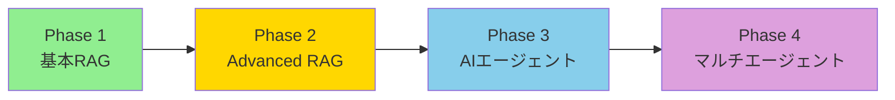

# プロジェクト概要

## 📌 Smart Docs Chat プロジェクト

### ビジョン
社内ナレッジの検索と活用を革新し、最終的には自律的に問題を解決するAIエージェントシステムを構築する。

### ミッション
1. **情報アクセスの民主化**: 誰もが必要な情報に瞬時にアクセスできる環境を作る
2. **業務効率の飛躍的向上**: 情報検索にかかる時間を90%削減
3. **AIとの共創**: 人間とAIが協調して価値を生み出す仕組みの実現

---

## 🎯 プロジェクトのゴール

### 短期目標（1週間）
- **Phase 1**: 基本RAGシステムの構築
- **Phase 2**: Advanced RAGによる検索精度90%超の達成
- **Phase 3**: LangGraphによる自律型エージェントの実装
- **Phase 4**: マルチエージェントシステムの構築

### 中期目標（1ヶ月）
- クラウドネイティブなアーキテクチャへの移行
- Slack/Teams統合による実用化
- リアルタイム更新機能の実装

### 長期目標（3ヶ月）
- 完全自律型AIアシスタントの実現
- 他部門・他社への展開
- オープンソース化とコミュニティ形成

---

## 🚀 プロジェクトの進化



### Phase 1: 基本RAGシステム
- **成果**: 検索精度69-88%を達成
- **技術**: LangChain + ChromaDB + OpenAI
- **学び**: 基本的なRAGパイプラインの構築方法

### Phase 2: Advanced RAG
- **目標**: 検索精度90-95%
- **技術**: HyDE, RAG-Fusion, Reranker
- **価値**: 実用レベルの検索精度

### Phase 3: LangGraphエージェント
- **目標**: 自律的な問題解決
- **技術**: LangGraph, ReAct, チェックポイント
- **価値**: 人間の介入を最小化

### Phase 4: マルチエージェント
- **目標**: 複雑なタスクの協調解決
- **技術**: Supervisor型アーキテクチャ
- **価値**: エンタープライズレベルの自動化

---

## 💡 ビジネスインパクト

### 定量的効果
| 指標 | 現状 | Phase 2後 | Phase 4後 |
|------|------|-----------|-----------|
| 情報検索時間 | 30分/回 | 5分/回 | 30秒/回 |
| 検索精度 | 40% | 90% | 95%+ |
| 人的コスト | 100% | 50% | 10% |
| 24/7対応 | ❌ | ❌ | ✅ |

### 定性的効果
- **ナレッジの活用促進**: 埋もれていた情報資産の有効活用
- **意思決定の高速化**: データドリブンな意思決定の実現
- **イノベーションの促進**: AIとの協創による新しいアイデアの創出
- **従業員満足度向上**: 単純作業からの解放

---

## 🏆 成功指標（KPI）

### 技術指標
- 検索精度（Precision/Recall）
- 応答時間（レイテンシー）
- システム稼働率
- エラー率

### ビジネス指標
- ユーザー満足度（NPS）
- 利用頻度
- 解決率
- ROI（投資対効果）

---

## 🔄 開発方法論

### アジャイル開発
- **スプリント**: 1日単位の短期スプリント
- **デイリーゴール**: 明確な日次成果物
- **継続的改善**: 毎日の振り返りと調整

### 技術選定の原則
1. **実績重視**: 本番環境での使用実績がある技術を優先
2. **学習曲線**: 短期間で習得可能な技術を選択
3. **コミュニティ**: 活発なコミュニティがある技術を採用
4. **将来性**: 長期的にサポートされる技術を選定

---

## 📚 参考資料とインスピレーション

### 書籍
- 「LangChainとLangGraphによる RAG・AIエージェント［実践］入門」（教科書）
- 「Designing Data-Intensive Applications」（システム設計）
- 「The Lean Startup」（開発手法）

### 論文
- "Retrieval-Augmented Generation for Knowledge-Intensive NLP Tasks" (RAG)
- "ReAct: Synergizing Reasoning and Acting in Language Models" (ReAct)
- "HyDE: Hypothetical Document Embeddings" (HyDE)

### 事例
- OpenAI ChatGPT Retrieval Plugin
- Microsoft Copilot
- Google Vertex AI Search

---

## 🤝 ステークホルダー

### 直接的な利用者
- 社内の全従業員
- 情報システム部門
- 経営層

### 間接的な受益者
- 顧客（より良いサービス提供）
- パートナー企業（効率的な協業）
- 株主（企業価値の向上）

---

## 📅 タイムライン

```
2025年1月: Phase 1完了
2025年1月21日: Phase 2開始
2025年1月22日: Phase 3開始
2025年1月23-24日: Phase 4実装
2025年1月25日: デモ・プレゼンテーション
```

---

## 🎓 学習と成長

このプロジェクトを通じて獲得するスキル：
- **RAG技術**: 最先端の検索拡張生成技術
- **AIエージェント開発**: 自律型AIシステムの設計と実装
- **LangGraph**: 次世代のAIワークフローフレームワーク
- **プロダクト開発**: 実用的なAIアプリケーションの構築

---

*最終更新: 2025年1月21日*