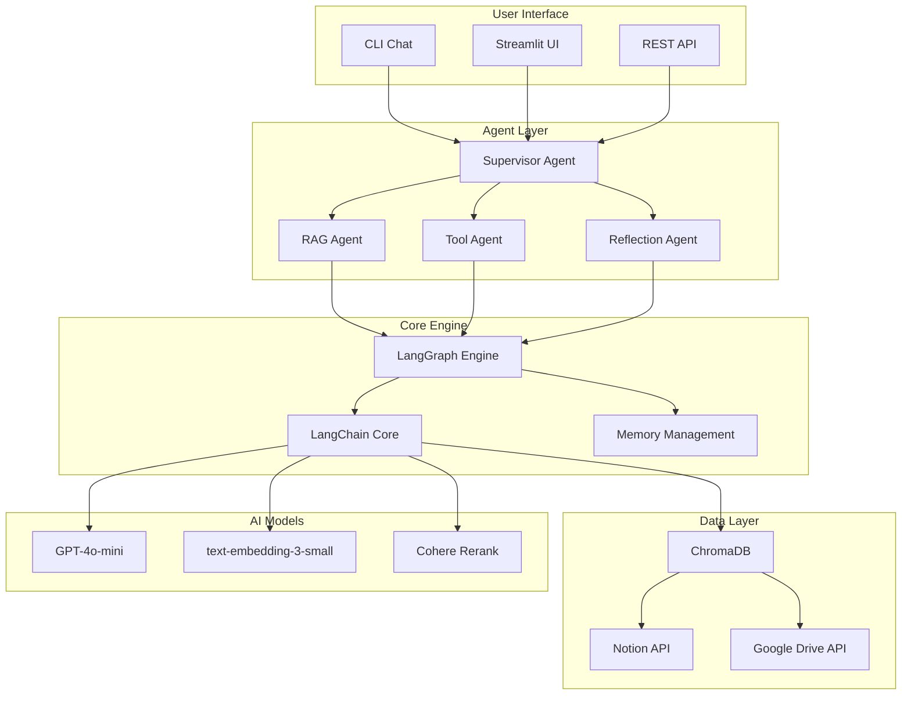
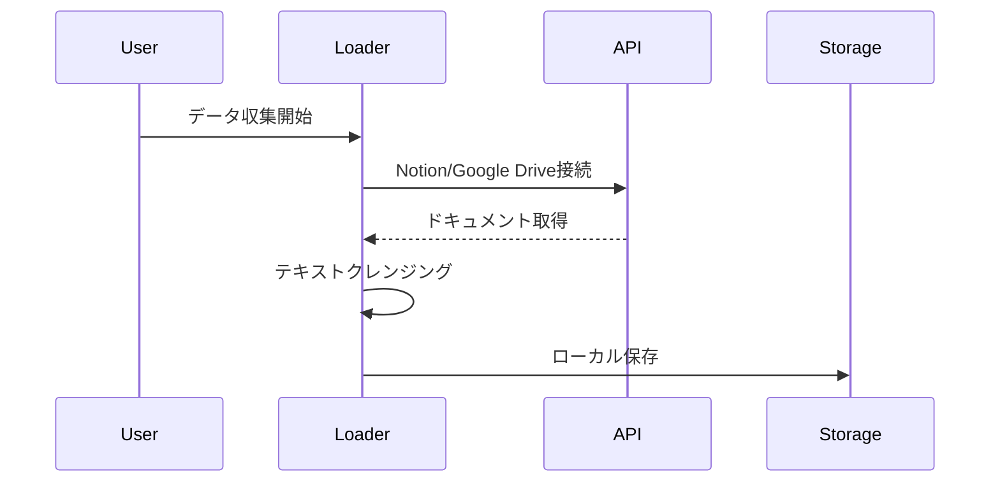
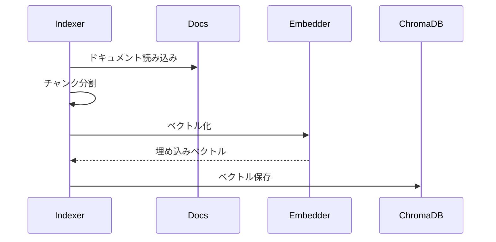
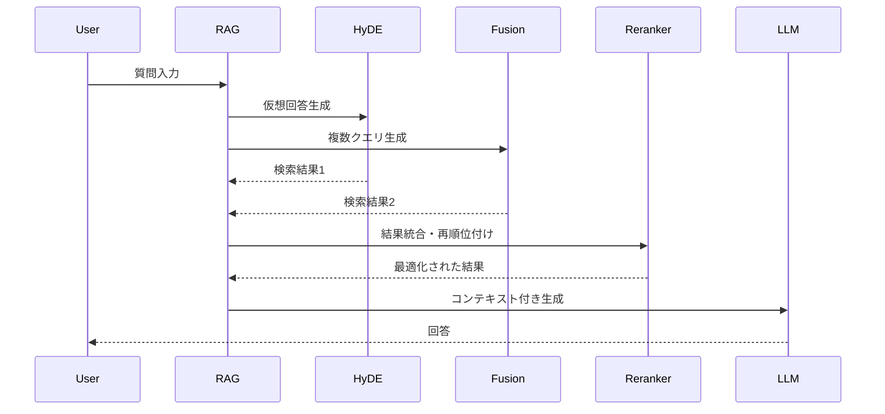

# 技術アーキテクチャ

## 🏗️ システム全体構成



---

## 📊 Phase別アーキテクチャ進化

### Phase 1: 基本RAG（完了）
```python
# シンプルな線形パイプライン
Query → Embedding → Vector Search → LLM → Response
```

### Phase 2: Advanced RAG（開発中）
```python
# 複数の検索戦略を組み合わせ
Query → [HyDE, RAG-Fusion, Multi-Query] → Rerank → LLM → Response
```

### Phase 3: LangGraphエージェント（計画中）
```python
# グラフベースの動的フロー
State → Node Decision → Action → State Update → Loop/End
```

### Phase 4: マルチエージェント（計画中）
```python
# 協調型エージェントシステム
Supervisor → Task Distribution → Parallel Execution → Result Aggregation
```

---

## 🔧 技術スタック詳細

### コア技術

| カテゴリ | 技術 | バージョン | 用途 |
|----------|------|------------|------|
| 言語 | Python | 3.11+ | メイン開発言語 |
| フレームワーク | LangChain | 0.3.x | LLMアプリケーション開発 |
| エージェント | LangGraph | 0.2.x | グラフベースワークフロー |
| ベクトルDB | ChromaDB | 0.5.x | ベクトル検索 |
| LLM | OpenAI GPT-4o-mini | - | テキスト生成 |
| 埋め込み | text-embedding-3-small | - | ベクトル化 |

### 追加コンポーネント

| カテゴリ | 技術 | 用途 |
|----------|------|------|
| Reranker | Cohere / Cross-Encoder | 検索結果の再順位付け |
| UI | Streamlit | Web インターフェース |
| API | FastAPI | REST API提供 |
| PDF処理 | pdfplumber | PDFテキスト抽出 |
| 監視 | LangSmith | トレース・デバッグ |

---

## 🗄️ データフロー

### 1. データ収集フロー


### 2. インデックス構築フロー


### 3. クエリ処理フロー（Advanced RAG）


---

## 🎯 Advanced RAG技術詳細

### HyDE (Hypothetical Document Embeddings)
```python
class HyDE:
    """
    ユーザーの質問から仮想的な回答を生成し、
    それを使って類似文書を検索する手法
    """
    def generate_hypothetical_answer(self, query: str) -> str:
        # LLMで仮想回答を生成
        prompt = f"以下の質問に対する詳細な回答を書いてください: {query}"
        return llm.generate(prompt)
    
    def search(self, hypothetical_answer: str) -> List[Document]:
        # 仮想回答でベクトル検索
        return vectorstore.similarity_search(hypothetical_answer)
```

### RAG-Fusion
```python
class RAGFusion:
    """
    複数の検索クエリを生成し、結果を統合する手法
    """
    def generate_queries(self, original_query: str) -> List[str]:
        # 元のクエリから複数の関連クエリを生成
        prompt = f"""
        以下の質問に関連する検索クエリを5つ生成してください:
        {original_query}
        """
        return llm.generate_list(prompt)
    
    def reciprocal_rank_fusion(self, results_list: List[List[Document]]) -> List[Document]:
        # 複数の検索結果をRRFで統合
        scores = {}
        for results in results_list:
            for rank, doc in enumerate(results):
                scores[doc.id] = scores.get(doc.id, 0) + 1/(rank + 60)
        return sorted(scores.items(), key=lambda x: x[1], reverse=True)
```

### Reranker
```python
class Reranker:
    """
    Cross-EncoderまたはCohere Rerankを使用した再順位付け
    """
    def rerank(self, query: str, documents: List[Document]) -> List[Document]:
        # Cohere Rerank API
        results = cohere.rerank(
            query=query,
            documents=[doc.page_content for doc in documents],
            model='rerank-multilingual-v3.0'
        )
        return [documents[r.index] for r in results.results]
```

---

## 🤖 LangGraphアーキテクチャ

### State管理
```python
class AgentState(TypedDict):
    messages: Annotated[list[BaseMessage], add_messages]
    next_step: str
    context: List[Document]
    reflection_count: int
    final_answer: str
```

### Node定義
```python
def reasoning_node(state: AgentState) -> AgentState:
    """推論を行うノード"""
    # 現在の状態から次のアクションを決定
    pass

def action_node(state: AgentState) -> AgentState:
    """アクションを実行するノード"""
    # ツールの呼び出しや検索を実行
    pass

def reflection_node(state: AgentState) -> AgentState:
    """結果を評価し、必要に応じて再試行"""
    pass
```

### Graph構築
```python
workflow = StateGraph(AgentState)

# ノードの追加
workflow.add_node("reasoning", reasoning_node)
workflow.add_node("action", action_node)
workflow.add_node("reflection", reflection_node)

# エッジの定義
workflow.add_edge("reasoning", "action")
workflow.add_conditional_edges(
    "reflection",
    should_continue,
    {
        "continue": "reasoning",
        "end": END
    }
)

# コンパイル
app = workflow.compile()
```

---

## 🔐 セキュリティアーキテクチャ

### データ保護
- **暗号化**: 保存時・転送時の暗号化
- **アクセス制御**: APIキーによる認証
- **監査ログ**: 全アクセスの記録

### プライバシー
- **データ分離**: ユーザーごとのデータ隔離
- **最小権限の原則**: 必要最小限のアクセス権
- **匿名化**: 個人情報の自動マスキング

---

## 📈 パフォーマンス最適化

### キャッシング戦略
```python
# 多層キャッシュアーキテクチャ
L1_Cache: Memory (< 1ms)
L2_Cache: Redis (< 10ms)  
L3_Cache: ChromaDB (< 100ms)
L4_Source: API Call (> 1000ms)
```

### バッチ処理
- **埋め込み生成**: 100件ずつバッチ処理
- **API呼び出し**: レート制限を考慮した並列処理
- **インデックス更新**: 差分更新による効率化

### 非同期処理
```python
async def process_queries(queries: List[str]):
    tasks = [process_single_query(q) for q in queries]
    results = await asyncio.gather(*tasks)
    return results
```

---

## 🔄 CI/CD パイプライン

### 開発フロー
```
1. Feature Branch作成
2. ローカル開発・テスト
3. Pull Request
4. 自動テスト実行
5. コードレビュー
6. マージ
7. 自動デプロイ（将来）
```

### テスト戦略
- **単体テスト**: 各コンポーネントの機能テスト
- **統合テスト**: エンドツーエンドのフロー検証
- **性能テスト**: レスポンスタイム、スループット測定
- **回帰テスト**: 既存機能の動作確認

---

## 📊 モニタリング

### メトリクス
- **システムメトリクス**: CPU、メモリ、ディスク使用率
- **アプリケーションメトリクス**: リクエスト数、エラー率、レイテンシ
- **ビジネスメトリクス**: 検索精度、ユーザー満足度

### ツール
- **LangSmith**: LLMアプリケーションの監視
- **Prometheus + Grafana**: システム監視（将来）
- **ELK Stack**: ログ分析（将来）

---

*最終更新: 2025年1月21日*