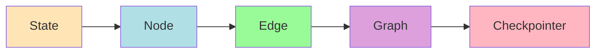

# Phase 3: LangGraphエージェント実装ガイド

## 📌 概要

Phase 3では、静的なRAGシステムから動的なAIエージェントへと進化させます。LangGraphを使用して、自律的に動作するエージェントを構築します。

## 🎯 Day 2の目標

### 実装タスク
- [ ] LangGraphの基本セットアップ
- [ ] State管理の実装
- [ ] ReActパターンの実装
- [ ] チェックポイント機能の実装
- [ ] エージェントの統合テスト

### 成果物
- `phase03-langgraph/src/agent_state.py`
- `phase03-langgraph/src/react_agent.py`
- `phase03-langgraph/src/tools.py`
- `phase03-langgraph/src/graph_builder.py`
- `phase03-langgraph/main.py`

---

## 🎯 LangGraphの基本概念

### コアコンセプト



1. **State**: エージェントの状態を管理
2. **Node**: 各処理ステップ
3. **Edge**: ノード間の接続
4. **Graph**: 全体のワークフロー
5. **Checkpointer**: 状態の保存と復元

---

## 🔧 実装詳細

### 1. State管理

```python
# phase03-langgraph/src/agent_state.py

from typing import TypedDict, List, Annotated, Sequence
from langchain_core.messages import BaseMessage, HumanMessage, AIMessage
from langgraph.graph import add_messages

class AgentState(TypedDict):
    """エージェントの状態を管理するクラス"""
    
    # メッセージ履歴
    messages: Annotated[Sequence[BaseMessage], add_messages]
    
    # 現在のステップ
    current_step: str
    
    # 検索結果
    search_results: List[str]
    
    # 中間結果
    intermediate_steps: List[tuple[str, str]]
    
    # 最終回答
    final_answer: str
    
    # リフレクションカウント
    reflection_count: int
    
    # エラー情報
    error: str
    
    # メタデータ
    metadata: dict

class ReActState(TypedDict):
    """ReActパターン用の状態"""
    
    # 入力クエリ
    input: str
    
    # 思考プロセス
    thoughts: List[str]
    
    # アクションログ
    actions: List[dict]
    
    # 観察結果
    observations: List[str]
    
    # 現在のステータス
    status: str  # "thinking", "acting", "observing", "complete"
    
    # 結果
    result: str
```

### 2. ツール定義

```python
# phase03-langgraph/src/tools.py

from langchain.tools import Tool
from langchain_chroma import Chroma
from langchain_openai import OpenAIEmbeddings
from typing import List, Dict
import json
import requests

class SearchTool:
    """ベクトル検索ツール"""
    
    def __init__(self, vectorstore_path: str = "./chroma_db"):
        self.vectorstore = Chroma(
            persist_directory=vectorstore_path,
            embedding_function=OpenAIEmbeddings(
                model="text-embedding-3-small"
            )
        )
    
    def search(self, query: str, k: int = 5) -> str:
        """ベクトルデータベースを検索"""
        results = self.vectorstore.similarity_search(query, k=k)
        
        # 結果をフォーマット
        formatted_results = []
        for i, doc in enumerate(results):
            formatted_results.append(
                f"[検索結果{i+1}]\n{doc.page_content[:500]}..."
            )
        
        return "\n\n".join(formatted_results)

class CalculatorTool:
    """計算ツール"""
    
    def calculate(self, expression: str) -> str:
        """数式を評価"""
        try:
            # 安全な評価のために許可された演算のみ
            allowed_names = {
                k: v for k, v in math.__dict__.items() if not k.startswith("__")
            }
            result = eval(expression, {"__builtins__": {}}, allowed_names)
            return f"計算結果: {expression} = {result}"
        except Exception as e:
            return f"計算エラー: {str(e)}"

class WebSearchTool:
    """Web検索ツール（モック）"""
    
    def search_web(self, query: str) -> str:
        """ウェブを検索（モック実装）"""
        # 実際にはGoogle Search API等を使用
        mock_results = [
            {
                "title": f"{query}に関する最新情報",
                "snippet": f"{query}についての詳細な情報...",
                "url": "https://example.com/article1"
            },
            {
                "title": f"{query}の完全ガイド",
                "snippet": f"{query}を理解するための包括的なガイド...",
                "url": "https://example.com/guide"
            }
        ]
        
        formatted = []
        for r in mock_results:
            formatted.append(
                f"Title: {r['title']}\nSnippet: {r['snippet']}\nURL: {r['url']}"
            )
        
        return "\n\n".join(formatted)

def create_tools() -> List[Tool]:
    """エージェント用のツールを作成"""
    
    search_tool = SearchTool()
    calc_tool = CalculatorTool()
    web_tool = WebSearchTool()
    
    tools = [
        Tool(
            name="search_knowledge_base",
            description="ナレッジベースを検索して関連情報を取得",
            func=search_tool.search
        ),
        Tool(
            name="calculator",
            description="数学的計算を実行",
            func=calc_tool.calculate
        ),
        Tool(
            name="search_web",
            description="ウェブから最新情報を検索",
            func=web_tool.search_web
        )
    ]
    
    return tools
```

### 3. ReActエージェント

```python
# phase03-langgraph/src/react_agent.py

from typing import Dict, List
from langchain_openai import ChatOpenAI
from langchain.prompts import PromptTemplate
from langgraph.prebuilt import ToolExecutor
from src.agent_state import ReActState
from src.tools import create_tools
import json

class ReActAgent:
    """ReActパターンを実装したエージェント"""
    
    def __init__(self):
        self.llm = ChatOpenAI(
            model="gpt-4o-mini",
            temperature=0
        )
        self.tools = create_tools()
        self.tool_executor = ToolExecutor(self.tools)
        
        self.react_prompt = PromptTemplate(
            input_variables=["input", "thought_history", "action_history"],
            template="""
            あなたはReActパターンに従うAIエージェントです。
            以下のステップを繰り返してタスクを完了させてください：
            1. Thought: 現在の状況を分析し、次に何をすべきか考える
            2. Action: 利用可能なツールから適切なものを選び実行
            3. Observation: ツールの結果を観察
            4. 必要に応じて1-3を繰り返す
            5. Answer: 最終的な回答を生成
            
            利用可能なツール:
            {tools}
            
            タスク: {input}
            
            これまでの思考:
            {thought_history}
            
            これまでのアクション:
            {action_history}
            
            次のステップ:
            """
        )
    
    def think(self, state: ReActState) -> Dict:
        """思考ステップ"""
        # ツールの説明を準備
        tools_desc = "\n".join([
            f"- {tool.name}: {tool.description}"
            for tool in self.tools
        ])
        
        # 履歴をフォーマット
        thought_history = "\n".join(state.get("thoughts", []))
        action_history = json.dumps(state.get("actions", []), ensure_ascii=False)
        
        # LLMに思考させる
        prompt = self.react_prompt.format(
            input=state["input"],
            tools=tools_desc,
            thought_history=thought_history,
            action_history=action_history
        )
        
        response = self.llm.invoke(prompt)
        thought = response.content
        
        # 状態を更新
        state["thoughts"].append(thought)
        
        # 次のアクションを決定
        if "Answer:" in thought:
            state["status"] = "complete"
            state["result"] = thought.split("Answer:")[1].strip()
        else:
            state["status"] = "acting"
        
        return state
    
    def act(self, state: ReActState) -> Dict:
        """アクション実行ステップ"""
        # 最新の思考からアクションを抽出
        latest_thought = state["thoughts"][-1]
        
        # アクションをパース（簡易実装）
        if "Action:" in latest_thought:
            action_text = latest_thought.split("Action:")[1].split("\n")[0]
            
            # ツール名と引数を抽出
            for tool in self.tools:
                if tool.name in action_text:
                    # 引数を抽出（簡易版）
                    arg = action_text.replace(tool.name, "").strip()
                    arg = arg.strip("()").strip('"')
                    
                    # ツールを実行
                    result = tool.func(arg)
                    
                    # 状態を更新
                    state["actions"].append({
                        "tool": tool.name,
                        "input": arg,
                        "output": result
                    })
                    state["observations"].append(result)
                    state["status"] = "thinking"
                    break
        
        return state
    
    def observe(self, state: ReActState) -> Dict:
        """観察ステップ"""
        # 最新の観察結果を思考に反映
        if state["observations"]:
            latest_observation = state["observations"][-1]
            state["thoughts"].append(f"Observation: {latest_observation}")
        
        state["status"] = "thinking"
        return state
```

### 4. LangGraphの構築

```python
# phase03-langgraph/src/graph_builder.py

from langgraph.graph import StateGraph, END
from langgraph.checkpoint import MemorySaver
from src.agent_state import AgentState, ReActState
from src.react_agent import ReActAgent
from typing import Dict

def create_react_graph():
    """ReActエージェントのグラフを構築"""
    
    # エージェントの初期化
    agent = ReActAgent()
    
    # グラフの初期化
    workflow = StateGraph(ReActState)
    
    # ノードの定義
    def init_node(state: Dict) -> Dict:
        """初期化ノード"""
        if "thoughts" not in state:
            state["thoughts"] = []
        if "actions" not in state:
            state["actions"] = []
        if "observations" not in state:
            state["observations"] = []
        state["status"] = "thinking"
        return state
    
    def should_continue(state: Dict) -> str:
        """継続条件の判定"""
        if state["status"] == "complete":
            return "end"
        elif state["status"] == "thinking":
            return "think"
        elif state["status"] == "acting":
            return "act"
        else:
            return "observe"
    
    # ノードの追加
    workflow.add_node("init", init_node)
    workflow.add_node("think", agent.think)
    workflow.add_node("act", agent.act)
    workflow.add_node("observe", agent.observe)
    
    # エッジの定義
    workflow.set_entry_point("init")
    workflow.add_edge("init", "think")
    
    # 条件付きエッジ
    workflow.add_conditional_edges(
        "think",
        should_continue,
        {
            "think": "think",
            "act": "act",
            "end": END
        }
    )
    
    workflow.add_edge("act", "observe")
    workflow.add_edge("observe", "think")
    
    # チェックポインターの設定
    checkpointer = MemorySaver()
    
    # コンパイル
    app = workflow.compile(checkpointer=checkpointer)
    
    return app

def create_advanced_graph():
    """より高度なエージェントグラフ"""
    
    workflow = StateGraph(AgentState)
    
    def reasoning_node(state: AgentState) -> AgentState:
        """推論ノード"""
        # 現在のコンテキストを分析
        messages = state["messages"]
        last_message = messages[-1] if messages else None
        
        # 次のアクションを決定
        if last_message and "search" in last_message.content.lower():
            state["current_step"] = "search"
        else:
            state["current_step"] = "respond"
        
        return state
    
    def search_node(state: AgentState) -> AgentState:
        """検索ノード"""
        from src.tools import SearchTool
        
        tool = SearchTool()
        query = state["messages"][-1].content
        results = tool.search(query)
        
        state["search_results"].append(results)
        state["current_step"] = "reflect"
        
        return state
    
    def reflection_node(state: AgentState) -> AgentState:
        """リフレクションノード"""
        # 結果の品質を評価
        if state["search_results"]:
            quality_score = len(state["search_results"][-1]) / 100
            
            if quality_score < 5 and state["reflection_count"] < 3:
                # 品質が低い場合は再検索
                state["current_step"] = "search"
                state["reflection_count"] += 1
            else:
                # 十分な品質または上限到達
                state["current_step"] = "respond"
        
        return state
    
    def respond_node(state: AgentState) -> AgentState:
        """応答ノード"""
        llm = ChatOpenAI(model="gpt-4o-mini")
        
        # コンテキストを構築
        context = "\n\n".join(state["search_results"])
        query = state["messages"][-1].content
        
        prompt = f"""
        以下の情報を基に質問に回答してください:
        
        コンテキスト:
        {context}
        
        質問: {query}
        """
        
        response = llm.invoke(prompt)
        state["final_answer"] = response.content
        state["messages"].append(AIMessage(content=response.content))
        
        return state
    
    # ノードの追加
    workflow.add_node("reasoning", reasoning_node)
    workflow.add_node("search", search_node)
    workflow.add_node("reflect", reflection_node)
    workflow.add_node("respond", respond_node)
    
    # エッジの定義
    workflow.set_entry_point("reasoning")
    
    def route_step(state: AgentState) -> str:
        return state["current_step"]
    
    workflow.add_conditional_edges(
        "reasoning",
        route_step,
        {
            "search": "search",
            "respond": "respond"
        }
    )
    
    workflow.add_edge("search", "reflect")
    
    workflow.add_conditional_edges(
        "reflect",
        route_step,
        {
            "search": "search",
            "respond": "respond"
        }
    )
    
    workflow.add_edge("respond", END)
    
    # コンパイル
    app = workflow.compile()
    
    return app
```

### 5. メインアプリケーション

```python
# phase03-langgraph/main.py

import asyncio
from src.graph_builder import create_react_graph, create_advanced_graph
from langchain_core.messages import HumanMessage
import json

async def test_react_agent():
    """リアクトエージェントのテスト"""
    print("=" * 60)
    print("ReActエージェントのテスト")
    print("=" * 60)
    
    # グラフの作成
    app = create_react_graph()
    
    # テストクエリ
    test_queries = [
        "LangGraphの基本的な使い方を教えて",
        "100 + 200 * 3の計算結果は？",
        "ReActパターンとは何か説明して"
    ]
    
    for query in test_queries:
        print(f"\n質問: {query}")
        print("-" * 40)
        
        # エージェントを実行
        config = {"configurable": {"thread_id": "test"}}
        
        result = await app.ainvoke(
            {"input": query},
            config=config
        )
        
        print(f"\n結果: {result.get('result', 'No result')}")
        print(f"\n思考プロセス:")
        for thought in result.get('thoughts', [])[:3]:
            print(f"  - {thought[:100]}...")
        
        print(f"\n実行されたアクション:")
        for action in result.get('actions', []):
            print(f"  - {action['tool']}: {action['input'][:50]}...")

async def test_advanced_agent():
    """高度なエージェントのテスト"""
    print("\n" + "=" * 60)
    print("高度なエージェントのテスト")
    print("=" * 60)
    
    # グラフの作成
    app = create_advanced_graph()
    
    # テストクエリ
    query = "LangGraphでチェックポイントを使う方法を教えて"
    
    print(f"\n質問: {query}")
    print("-" * 40)
    
    # エージェントを実行
    result = await app.ainvoke({
        "messages": [HumanMessage(content=query)],
        "search_results": [],
        "reflection_count": 0,
        "intermediate_steps": [],
        "metadata": {}
    })
    
    print(f"\n最終回答:")
    print(result.get("final_answer", "No answer"))
    
    print(f"\n検索結果数: {len(result.get('search_results', []))}")
    print(f"リフレクション回数: {result.get('reflection_count', 0)}")

async def demonstrate_checkpointing():
    """チェックポイント機能のデモ"""
    print("\n" + "=" * 60)
    print("チェックポイント機能のデモ")
    print("=" * 60)
    
    app = create_react_graph()
    config = {"configurable": {"thread_id": "demo_thread"}}
    
    # ステップち1: 初回実行
    print("\n[ステップ 1] 初回実行")
    result1 = await app.ainvoke(
        {"input": "Pythonのリスト内包表記とは？"},
        config=config
    )
    print(f"結果: {result1.get('result', '')[:100]}...")
    
    # ステップぢ2: 同じthread_idで続きを実行
    print("\n[ステップ 2] 同じスレッドで続きの質問")
    result2 = await app.ainvoke(
        {"input": "それを使った例をと3つ教えて"},
        config=config
    )
    print(f"結果: {result2.get('result', '')[:100]}...")
    
    # 状態が保持されていることを確認
    print(f"\n保持された思考数: {len(result2.get('thoughts', []))}")
    print(f"保持されたアクション数: {len(result2.get('actions', []))}")

async def main():
    """メイン関数"""
    print("🤖 LangGraphエージェントシステム")
    print("=" * 60)
    
    # 各テストを実行
    await test_react_agent()
    await test_advanced_agent()
    await demonstrate_checkpointing()
    
    print("\n" + "=" * 60)
    print("✅ すべてのテストが完了しました")
    print("=" * 60)

if __name__ == "__main__":
    asyncio.run(main())
```

---

## 📊 期待される成果

### 機能比較

| 機能 | Phase 2 (RAG) | Phase 3 (Agent) |
|------|--------------|----------------|
| 検索精度 | 90-95% | 90-95% |
| 自律性 | なし | 高 |
| ツール使用 | 固定 | 動的 |
| エラー回復 | なし | あり |
| 状態管理 | なし | あり |

### 実装上の利点

1. **柔軟なワークフロー**: グラフで定義
2. **チェックポイント**: 中断・再開可能
3. **ツール統合**: 様々な外部ツールを使用
4. **リフレクション**: 結果を自己評価

---

## 🚀 セットアップ手順

### 1. 環境構築
```bash
cd phase03-langgraph
python -m venv .venv
source .venv/bin/activate
pip install -r requirements.txt
```

### 2. 必要パッケージ
```txt
# requirements.txt
langgraph>=0.2.0
langchain>=0.3.0
langchain-openai>=0.2.0
langchain-chroma>=0.1.0
langsmith>=0.1.0
python-dotenv>=1.0.0
```

### 3. 実行
```bash
# メインデモ
python main.py

# 特定のテスト
python -c "import asyncio; from main import test_react_agent; asyncio.run(test_react_agent())"
```

---

## 📝 Day 2のタイムライン

| 時間 | タスク |
|------|------|
| 9:00-10:30 | LangGraph基礎とState管理 |
| 10:30-12:00 | ReActエージェント実装 |
| 13:00-14:30 | ツール統合とグラフ構築 |
| 14:30-16:00 | チェックポイント実装 |
| 16:00-17:30 | 統合テストとデバッグ |
| 17:30-18:00 | ドキュメント作成 |

---

## 🎯 成功基準

- [ ] ReActパターンの実装完了
- [ ] 3つ以上のツール統合
- [ ] チェックポイント機能動作
- [ ] リフレクション機能実装
- [ ] 全テストパス

---

## 🔗 Phase 4への橋渡し

Phase 3で構築したエージェントをベースに、Phase 4では：

1. **マルチエージェント化**: 複数の専門エージェント
2. **Supervisorパターン**: エージェントの管理と調整
3. **高度な協調**: エージェント間の通信

---

*最終更新: 2025年1月21日*