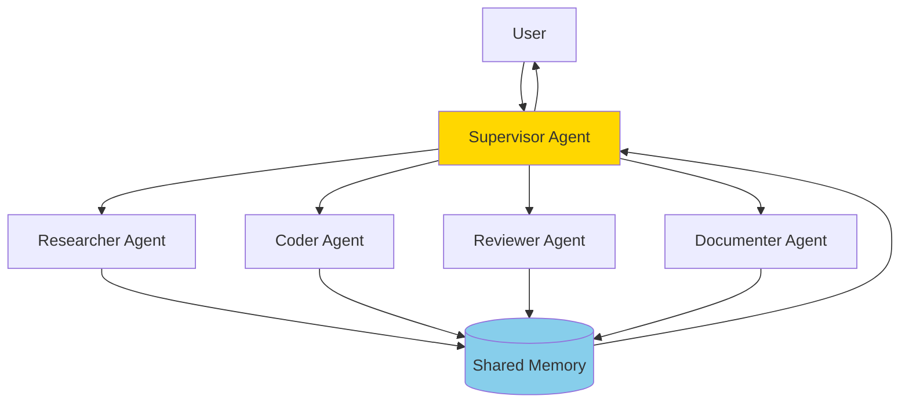

# Phase 4: マルチエージェントシステム実装ガイド

## 📌 概要

Phase 4では、複数の専門エージェントが協調して動作するマルチエージェントシステムを構築します。

## 🎯 Day 3-4の目標

### Day 3: エージェントの知能化
- [ ] セルフリフレクション機能の実装
- [ ] 要件定義エージェント
- [ ] Plan-and-Executeパターン

### Day 4: マルチエージェント系
- [ ] Supervisor型アーキテクチャ
- [ ] エージェント間通信
- [ ] Streamlit UI統合

---

## 🤖 アーキテクチャ

### Supervisor型マルチエージェント



---

## 🔧 Day 3: エージェントの知能化

### 1. セルフリフレクションエージェント

```python
# phase04-multi-agent/src/self_reflection.py

from typing import Dict, List, Optional
from langchain_openai import ChatOpenAI
from langchain.prompts import PromptTemplate
from pydantic import BaseModel, Field

class ReflectionResult(BaseModel):
    """リフレクション結果"""
    quality_score: float = Field(description="品質スコア（0-10）")
    completeness: float = Field(description="完全性（0-10）")
    clarity: float = Field(description="明瞭性（0-10）")
    improvements: List[str] = Field(description="改善点")
    is_satisfactory: bool = Field(description="満足できるか")

class SelfReflectionAgent:
    """自己評価・改善を行うエージェント"""
    
    def __init__(self, max_iterations: int = 3):
        self.llm = ChatOpenAI(model="gpt-4o-mini", temperature=0)
        self.max_iterations = max_iterations
        
        self.reflection_prompt = PromptTemplate(
            input_variables=["task", "response", "criteria"],
            template="""
            以下のタスクと応答を評価してください。
            
            タスク: {task}
            
            応答: {response}
            
            評価基準:
            {criteria}
            
            以下の観点から評価し、JSON形式で出力してください:
            - quality_score: 全体的な品質 (0-10)
            - completeness: タスクの完全性 (0-10)
            - clarity: 明瞭性・理解しやすさ (0-10)
            - improvements: 改善すべき点のリスト
            - is_satisfactory: 合格基準を満たしているか (true/false)
            """
        )
        
        self.improvement_prompt = PromptTemplate(
            input_variables=["task", "original_response", "feedback"],
            template="""
            以下のフィードバックを基に応答を改善してください。
            
            タスク: {task}
            
            元の応答: {original_response}
            
            フィードバック: {feedback}
            
            改善された応答:
            """
        )
    
    def reflect(self, task: str, response: str, criteria: str = "") -> ReflectionResult:
        """応答を評価"""
        if not criteria:
            criteria = """
            - タスクの要求を満たしているか
            - 情報の正確性
            - 論理的な構成
            - 実用性
            """
        
        prompt = self.reflection_prompt.format(
            task=task,
            response=response,
            criteria=criteria
        )
        
        result = self.llm.invoke(prompt)
        
        # JSONパース
        import json
        try:
            reflection_data = json.loads(result.content)
            return ReflectionResult(**reflection_data)
        except:
            # パースエラー時のデフォルト
            return ReflectionResult(
                quality_score=5.0,
                completeness=5.0,
                clarity=5.0,
                improvements=["Could not parse reflection"],
                is_satisfactory=False
            )
    
    def improve(self, task: str, response: str, feedback: List[str]) -> str:
        """フィードバックを基に応答を改善"""
        feedback_text = "\n".join([f"- {f}" for f in feedback])
        
        prompt = self.improvement_prompt.format(
            task=task,
            original_response=response,
            feedback=feedback_text
        )
        
        result = self.llm.invoke(prompt)
        return result.content
    
    def execute_with_reflection(
        self,
        task: str,
        initial_response_generator,
        criteria: str = ""
    ) -> Dict:
        """リフレクション付きでタスクを実行"""
        iteration = 0
        current_response = initial_response_generator(task)
        history = []
        
        while iteration < self.max_iterations:
            # 現在の応答を評価
            reflection = self.reflect(task, current_response, criteria)
            
            history.append({
                "iteration": iteration,
                "response": current_response,
                "reflection": reflection.dict()
            })
            
            # 満足できる場合は終了
            if reflection.is_satisfactory:
                break
            
            # 改善が必要な場合
            if reflection.improvements:
                current_response = self.improve(
                    task,
                    current_response,
                    reflection.improvements
                )
            
            iteration += 1
        
        return {
            "final_response": current_response,
            "iterations": iteration + 1,
            "history": history,
            "final_score": history[-1]["reflection"]["quality_score"] if history else 0
        }
```

### 2. 要件定義エージェント

```python
# phase04-multi-agent/src/requirements_agent.py

from typing import Dict, List
from langchain_openai import ChatOpenAI
from pydantic import BaseModel, Field

class UserPersona(BaseModel):
    """ユーザーペルソナ"""
    name: str = Field(description="ペルソナ名")
    role: str = Field(description="役割")
    goals: List[str] = Field(description="目標")
    pain_points: List[str] = Field(description="課題・痛み")
    expectations: List[str] = Field(description="期待")

class Requirement(BaseModel):
    """要件"""
    category: str = Field(description="カテゴリ")
    description: str = Field(description="説明")
    priority: str = Field(description="優先度")
    acceptance_criteria: List[str] = Field(description="受入基準")

class RequirementsAgent:
    """要件定義を自動生成するエージェント"""
    
    def __init__(self):
        self.llm = ChatOpenAI(model="gpt-4o-mini", temperature=0.7)
    
    def generate_personas(self, project_description: str) -> List[UserPersona]:
        """プロジェクトからペルソナを生成"""
        prompt = f"""
        以下のプロジェクトに関連するユーザーペルソナを3つ生成してください。
        
        プロジェクト: {project_description}
        
        各ペルソナについて以下を含めてJSON形式で出力:
        - name: ペルソナ名
        - role: 役割・職種
        - goals: 目標（3つ）
        - pain_points: 課題・痛み（3つ）
        - expectations: 期待（3つ）
        """
        
        response = self.llm.invoke(prompt)
        
        # JSONパースしてUserPersonaオブジェクトに変換
        import json
        personas_data = json.loads(response.content)
        
        return [UserPersona(**p) for p in personas_data]
    
    def interview_persona(self, persona: UserPersona, context: str) -> List[Dict[str, str]]:
        """ペルソナにインタビュー"""
        prompt = f"""
        あなたは{persona.name}という{persona.role}です。
        以下のコンテキストについて、5つの質問に答えてください。
        
        コンテキスト: {context}
        
        目標: {persona.goals}
        課題: {persona.pain_points}
        
        質問:
        1. このシステムで最も重要な機能は何ですか？
        2. 現在の業務で最も時間がかかる作業は何ですか？
        3. 理想的なワークフローを教えてください。
        4. どのようなデータやレポートが必要ですか？
        5. システムに期待するパフォーマンスは？
        """
        
        response = self.llm.invoke(prompt)
        
        # 回答をパース
        answers = response.content.split("\n\n")
        
        interview_results = []
        questions = [
            "最も重要な機能",
            "時間がかかる作業",
            "理想的なワークフロー",
            "必要なデータ・レポート",
            "期待するパフォーマンス"
        ]
        
        for q, a in zip(questions, answers):
            interview_results.append({
                "question": q,
                "answer": a.strip()
            })
        
        return interview_results
    
    def generate_requirements(
        self,
        project_description: str,
        interviews: List[Dict]
    ) -> List[Requirement]:
        """インタビュー結果から要件を生成"""
        interview_summary = "\n".join([
            f"- {i['question']}: {i['answer']}"
            for i in interviews
        ])
        
        prompt = f"""
        以下の情報を基に、システム要件を5つ生成してください。
        
        プロジェクト: {project_description}
        
        インタビュー結果:
        {interview_summary}
        
        各要件についてJSON形式で出力:
        - category: 機能/非機能/ビジネス
        - description: 要件の説明
        - priority: 高/中/低
        - acceptance_criteria: 受入基準（3つ）
        """
        
        response = self.llm.invoke(prompt)
        
        import json
        requirements_data = json.loads(response.content)
        
        return [Requirement(**r) for r in requirements_data]
```

### 3. Plan-and-Executeパターン

```python
# phase04-multi-agent/src/plan_execute.py

from typing import List, Dict, Any
from langchain_openai import ChatOpenAI
from pydantic import BaseModel, Field

class TaskPlan(BaseModel):
    """タスク計画"""
    step_number: int = Field(description="ステップ番号")
    description: str = Field(description="タスク説明")
    dependencies: List[int] = Field(description="依存ステップ")
    estimated_time: str = Field(description="推定時間")
    required_tools: List[str] = Field(description="必要なツール")

class PlanExecuteAgent:
    """Plan-and-Executeパターンのエージェント"""
    
    def __init__(self):
        self.planner = ChatOpenAI(model="gpt-4o-mini", temperature=0)
        self.executor = ChatOpenAI(model="gpt-4o-mini", temperature=0)
    
    def create_plan(self, objective: str, context: str = "") -> List[TaskPlan]:
        """目標から計画を作成"""
        prompt = f"""
        以下の目標を達成するための詳細なステップバイステップの計画を作成してください。
        
        目標: {objective}
        
        コンテキスト: {context}
        
        各ステップについてJSON形式で出力:
        - step_number: ステップ番号
        - description: 何をするか
        - dependencies: 依存するステップ番号のリスト
        - estimated_time: 推定時間
        - required_tools: 必要なツール・リソース
        """
        
        response = self.planner.invoke(prompt)
        
        import json
        plan_data = json.loads(response.content)
        
        return [TaskPlan(**step) for step in plan_data]
    
    def execute_step(
        self,
        step: TaskPlan,
        previous_results: Dict[int, Any]
    ) -> Dict:
        """単一ステップを実行"""
        # 依存結果を収集
        dependencies_context = ""
        for dep in step.dependencies:
            if dep in previous_results:
                dependencies_context += f"\nステップ{dep}の結果: {previous_results[dep]}"
        
        prompt = f"""
        以下のタスクを実行してください。
        
        タスク: {step.description}
        
        利用可能なツール: {step.required_tools}
        
        前のステップの結果:
        {dependencies_context}
        
        実行結果を詳細に説明してください。
        """
        
        response = self.executor.invoke(prompt)
        
        return {
            "step_number": step.step_number,
            "description": step.description,
            "result": response.content,
            "status": "completed"
        }
    
    def execute_plan(self, plan: List[TaskPlan]) -> List[Dict]:
        """計画全体を実行"""
        results = {}
        execution_log = []
        
        for step in plan:
            # 依存関係をチェック
            can_execute = all(
                dep in results for dep in step.dependencies
            )
            
            if can_execute:
                result = self.execute_step(step, results)
                results[step.step_number] = result["result"]
                execution_log.append(result)
            else:
                execution_log.append({
                    "step_number": step.step_number,
                    "description": step.description,
                    "status": "skipped",
                    "reason": "Dependencies not met"
                })
        
        return execution_log
```

---

## 🔧 Day 4: マルチエージェントシステム

### 1. Supervisorエージェント

```python
# phase04-multi-agent/src/supervisor.py

from typing import Dict, List, Any, Optional
from langchain_openai import ChatOpenAI
from enum import Enum
import asyncio

class AgentType(Enum):
    RESEARCHER = "researcher"
    CODER = "coder"
    REVIEWER = "reviewer"
    DOCUMENTER = "documenter"

class SupervisorAgent:
    """Supervisorエージェント - 他のエージェントを管理"""
    
    def __init__(self):
        self.llm = ChatOpenAI(model="gpt-4o-mini", temperature=0)
        self.agents = {}
        self.shared_memory = {}
    
    def register_agent(self, agent_type: AgentType, agent: Any):
        """エージェントを登録"""
        self.agents[agent_type] = agent
    
    def analyze_task(self, task: str) -> List[AgentType]:
        """タスクを分析して必要なエージェントを決定"""
        prompt = f"""
        以下のタスクを分析し、必要なエージェントを選択してください。
        
        タスク: {task}
        
        利用可能なエージェント:
        - researcher: 情報収集・調査
        - coder: コード作成・実装
        - reviewer: レビュー・品質チェック
        - documenter: ドキュメント作成
        
        必要なエージェントをカンマ区切りで出力:
        """
        
        response = self.llm.invoke(prompt)
        
        # エージェントタイプをパース
        agent_names = response.content.strip().split(",")
        agent_types = []
        
        for name in agent_names:
            name = name.strip()
            try:
                agent_type = AgentType(name)
                agent_types.append(agent_type)
            except ValueError:
                continue
        
        return agent_types
    
    def delegate_task(
        self,
        agent_type: AgentType,
        task: str,
        context: Dict = None
    ) -> Dict:
        """タスクをエージェントに委譲"""
        if agent_type not in self.agents:
            return {
                "error": f"Agent {agent_type.value} not found",
                "status": "failed"
            }
        
        agent = self.agents[agent_type]
        
        # コンテキストを追加
        full_context = {
            "task": task,
            "shared_memory": self.shared_memory,
            "additional_context": context or {}
        }
        
        # エージェントを実行
        result = agent.execute(full_context)
        
        # 結果を共有メモリに保存
        self.shared_memory[agent_type.value] = result
        
        return result
    
    async def coordinate_agents(
        self,
        task: str,
        sequential: bool = False
    ) -> Dict:
        """複数エージェントを調整"""
        # 必要なエージェントを分析
        required_agents = self.analyze_task(task)
        
        if sequential:
            # 順次実行
            results = {}
            for agent_type in required_agents:
                result = self.delegate_task(agent_type, task)
                results[agent_type.value] = result
        else:
            # 並列実行
            tasks = [
                asyncio.create_task(
                    asyncio.to_thread(
                        self.delegate_task,
                        agent_type,
                        task
                    )
                )
                for agent_type in required_agents
            ]
            
            agent_results = await asyncio.gather(*tasks)
            results = {
                agent_type.value: result
                for agent_type, result in zip(required_agents, agent_results)
            }
        
        # 統合結果を生成
        return self.synthesize_results(task, results)
    
    def synthesize_results(self, task: str, results: Dict) -> Dict:
        """複数エージェントの結果を統合"""
        results_summary = "\n".join([
            f"{agent}: {result.get('summary', str(result)[:200])}"
            for agent, result in results.items()
        ])
        
        prompt = f"""
        以下の複数エージェントの結果を統合して、
        最終的な応答を生成してください。
        
        元のタスク: {task}
        
        エージェントの結果:
        {results_summary}
        
        統合された最終応答:
        """
        
        response = self.llm.invoke(prompt)
        
        return {
            "task": task,
            "agents_used": list(results.keys()),
            "individual_results": results,
            "final_answer": response.content,
            "shared_memory": self.shared_memory
        }
```

### 2. 専門エージェントの実装

```python
# phase04-multi-agent/src/specialized_agents.py

from typing import Dict, Any
from langchain_openai import ChatOpenAI
from abc import ABC, abstractmethod

class BaseAgent(ABC):
    """エージェントの基底クラス"""
    
    def __init__(self, name: str):
        self.name = name
        self.llm = ChatOpenAI(model="gpt-4o-mini", temperature=0)
    
    @abstractmethod
    def execute(self, context: Dict) -> Dict:
        pass

class ResearcherAgent(BaseAgent):
    """調査・情報収集エージェント"""
    
    def __init__(self):
        super().__init__("Researcher")
    
    def execute(self, context: Dict) -> Dict:
        task = context.get("task", "")
        
        prompt = f"""
        以下のタスクについて調査し、詳細な情報を提供してください。
        
        タスク: {task}
        
        調査内容:
        1. 背景情報
        2. 関連技術
        3. ベストプラクティス
        4. 注意点
        5. 参考資料
        """
        
        response = self.llm.invoke(prompt)
        
        return {
            "agent": self.name,
            "task": task,
            "research": response.content,
            "summary": response.content[:200] + "...",
            "status": "completed"
        }

class CoderAgent(BaseAgent):
    """コード作成エージェント"""
    
    def __init__(self):
        super().__init__("Coder")
    
    def execute(self, context: Dict) -> Dict:
        task = context.get("task", "")
        shared_memory = context.get("shared_memory", {})
        
        # リサーチャーの結果があれば参照
        research = shared_memory.get("researcher", {}).get("research", "")
        
        prompt = f"""
        以下のタスクに対するコードを作成してください。
        
        タスク: {task}
        
        参考情報:
        {research[:500] if research else "なし"}
        
        コードは以下の要件を満たしてください:
        - クリーンで読みやすい
        - エラーハンドリングを含む
        - ドキュメント付き
        """
        
        response = self.llm.invoke(prompt)
        
        return {
            "agent": self.name,
            "task": task,
            "code": response.content,
            "summary": "コードを生成しました",
            "status": "completed"
        }

class ReviewerAgent(BaseAgent):
    """レビューエージェント"""
    
    def __init__(self):
        super().__init__("Reviewer")
    
    def execute(self, context: Dict) -> Dict:
        task = context.get("task", "")
        shared_memory = context.get("shared_memory", {})
        
        # コーダーの結果があればレビュー
        code = shared_memory.get("coder", {}).get("code", "")
        
        prompt = f"""
        以下の内容をレビューしてください。
        
        タスク: {task}
        
        レビュー対象:
        {code if code else task}
        
        レビュー観点:
        1. 正確性
        2. 完全性
        3. パフォーマンス
        4. セキュリティ
        5. 改善提案
        """
        
        response = self.llm.invoke(prompt)
        
        return {
            "agent": self.name,
            "task": task,
            "review": response.content,
            "summary": "レビュー完了",
            "status": "completed"
        }

class DocumenterAgent(BaseAgent):
    """ドキュメント作成エージェント"""
    
    def __init__(self):
        super().__init__("Documenter")
    
    def execute(self, context: Dict) -> Dict:
        task = context.get("task", "")
        shared_memory = context.get("shared_memory", {})
        
        # 他のエージェントの結果を収集
        all_results = "\n".join([
            f"{agent}: {data.get('summary', '')}"
            for agent, data in shared_memory.items()
        ])
        
        prompt = f"""
        以下のタスクと結果についてドキュメントを作成してください。
        
        タスク: {task}
        
        各エージェントの結果:
        {all_results}
        
        ドキュメントに含める内容:
        1. 概要
        2. 実装詳細
        3. 使用方法
        4. 注意点
        5. 参考情報
        """
        
        response = self.llm.invoke(prompt)
        
        return {
            "agent": self.name,
            "task": task,
            "documentation": response.content,
            "summary": "ドキュメント作成完了",
            "status": "completed"
        }
```

### 3. Streamlit UI

```python
# phase04-multi-agent/app.py

import streamlit as st
import asyncio
from src.supervisor import SupervisorAgent, AgentType
from src.specialized_agents import (
    ResearcherAgent,
    CoderAgent,
    ReviewerAgent,
    DocumenterAgent
)
from src.self_reflection import SelfReflectionAgent
from src.requirements_agent import RequirementsAgent
from src.plan_execute import PlanExecuteAgent

st.set_page_config(
    page_title="Multi-Agent System",
    page_icon="🤖",
    layout="wide"
)

st.title("🤖 マルチエージェントシステム")
st.markdown("""
複数のAIエージェントが協調してタスクを実行します。
""")

# サイドバー設定
st.sidebar.header("設定")

agent_mode = st.sidebar.selectbox(
    "モード選択",
    [
        "マルチエージェント",
        "セルフリフレクション",
        "要件定義",
        "Plan-and-Execute"
    ]
)

execution_mode = st.sidebar.radio(
    "実行モード",
    ["並列", "順次"]
)

# メインエリア
if agent_mode == "マルチエージェント":
    st.header("👥 マルチエージェントモード")
    
    task = st.text_area(
        "タスクを入力",
        height=100,
        placeholder="例: LangGraphを使ったRAGシステムの設計と実装"
    )
    
    if st.button("実行", type="primary"):
        with st.spinner("エージェントが作業中..."):
            # Supervisorの初期化
            supervisor = SupervisorAgent()
            
            # エージェントの登録
            supervisor.register_agent(AgentType.RESEARCHER, ResearcherAgent())
            supervisor.register_agent(AgentType.CODER, CoderAgent())
            supervisor.register_agent(AgentType.REVIEWER, ReviewerAgent())
            supervisor.register_agent(AgentType.DOCUMENTER, DocumenterAgent())
            
            # 実行
            sequential = (execution_mode == "順次")
            result = asyncio.run(
                supervisor.coordinate_agents(task, sequential=sequential)
            )
            
            # 結果表示
            st.success("完了！")
            
            # 使用されたエージェント
            st.subheader("🤖 使用されたエージェント")
            cols = st.columns(len(result["agents_used"]))
            for i, agent in enumerate(result["agents_used"]):
                with cols[i]:
                    st.metric(agent.title(), "✅ 完了")
            
            # 最終結果
            st.subheader("📝 最終結果")
            st.write(result["final_answer"])
            
            # 個別結果
            with st.expander("🔍 詳細結果"):
                for agent, data in result["individual_results"].items():
                    st.subheader(f"{agent} エージェント")
                    if isinstance(data, dict):
                        for key, value in data.items():
                            if key != "summary":
                                st.write(f"**{key}**: {value[:500]}...")
                    else:
                        st.write(data)

elif agent_mode == "セルフリフレクション":
    st.header("🤔 セルフリフレクションモード")
    
    task = st.text_area(
        "タスクを入力",
        height=100
    )
    
    max_iterations = st.slider(
        "最大反復回数",
        min_value=1,
        max_value=5,
        value=3
    )
    
    if st.button("実行", type="primary"):
        agent = SelfReflectionAgent(max_iterations=max_iterations)
        
        # 初回応答生成関数
        def initial_generator(t):
            llm = ChatOpenAI(model="gpt-4o-mini")
            return llm.invoke(t).content
        
        with st.spinner("リフレクション中..."):
            result = agent.execute_with_reflection(
                task,
                initial_generator
            )
        
        st.success(f"完了！{result['iterations']}回の反復")
        
        # 最終結果
        st.subheader("🎯 最終結果")
        st.write(result["final_response"])
        
        # スコア
        st.metric("最終スコア", f"{result['final_score']:.1f}/10")
        
        # 履歴
        with st.expander("📊 改善履歴"):
            for item in result["history"]:
                st.write(f"**反復 {item['iteration'] + 1}**")
                st.write(f"スコア: {item['reflection']['quality_score']:.1f}")
                st.write(f"改善点: {item['reflection']['improvements']}")

elif agent_mode == "要件定義":
    st.header("📄 要件定義モード")
    
    project = st.text_area(
        "プロジェクト説明",
        height=100,
        placeholder="例: 社内ドキュメントをAIで検索できるシステム"
    )
    
    if st.button("要件生成", type="primary"):
        agent = RequirementsAgent()
        
        with st.spinner("ペルソナ生成中..."):
            personas = agent.generate_personas(project)
        
        st.subheader("👥 ユーザーペルソナ")
        
        for persona in personas:
            with st.expander(f"{persona.name} - {persona.role}"):
                st.write(f"**目標**: {persona.goals}")
                st.write(f"**課題**: {persona.pain_points}")
                st.write(f"**期待**: {persona.expectations}")
                
                # インタビュー
                if st.button(f"{persona.name}にインタビュー", key=persona.name):
                    interview = agent.interview_persona(persona, project)
                    
                    st.write("🎙️ インタビュー結果")
                    for qa in interview:
                        st.write(f"**Q: {qa['question']}**")
                        st.write(f"A: {qa['answer']}")
        
        # 要件生成
        if st.button("要件を生成"):
            with st.spinner("要件生成中..."):
                # すべてのペルソナにインタビュー
                all_interviews = []
                for p in personas:
                    interviews = agent.interview_persona(p, project)
                    all_interviews.extend(interviews)
                
                requirements = agent.generate_requirements(
                    project,
                    all_interviews
                )
            
            st.subheader("📝 生成された要件")
            
            for req in requirements:
                with st.expander(f"{req.category}: {req.description[:50]}..."):
                    st.write(f"**優先度**: {req.priority}")
                    st.write(f"**説明**: {req.description}")
                    st.write("**受入基準**:")
                    for criteria in req.acceptance_criteria:
                        st.write(f"- {criteria}")

elif agent_mode == "Plan-and-Execute":
    st.header("🗺️ Plan-and-Executeモード")
    
    objective = st.text_area(
        "目標を入力",
        height=100
    )
    
    if st.button("計画作成", type="primary"):
        agent = PlanExecuteAgent()
        
        with st.spinner("計画作成中..."):
            plan = agent.create_plan(objective)
        
        st.subheader("📋 実行計画")
        
        # 計画表示
        for step in plan:
            with st.expander(f"ステップ {step.step_number}: {step.description[:50]}..."):
                st.write(f"**説明**: {step.description}")
                st.write(f"**推定時間**: {step.estimated_time}")
                st.write(f"**依存**: {step.dependencies}")
                st.write(f"**ツール**: {step.required_tools}")
        
        # 実行
        if st.button("計画を実行"):
            with st.spinner("実行中..."):
                execution_log = agent.execute_plan(plan)
            
            st.subheader("✅ 実行結果")
            
            for log in execution_log:
                if log["status"] == "completed":
                    st.success(f"ステップ {log['step_number']}: 完了")
                    with st.expander("詳細"):
                        st.write(log["result"])
                else:
                    st.warning(f"ステップ {log['step_number']}: {log['status']}")

if __name__ == "__main__":
    st.sidebar.markdown("---")
    st.sidebar.info(
        """
        **Phase 4 マルチエージェントシステム**
        
        複数のAIエージェントが協調して
        複雑なタスクを解決します。
        """
    )
```

---

## 🚀 実行手順

```bash
# 環境セットアップ
cd phase04-multi-agent
python -m venv .venv
source .venv/bin/activate

# 依存パッケージ
pip install -r requirements.txt

# Streamlitアプリ起動
streamlit run app.py
```

---

## 🎯 成功基準

### Day 3
- [ ] セルフリフレクション完動
- [ ] 要件定義エージェント実装
- [ ] Plan-and-Execute実装

### Day 4
- [ ] Supervisorエージェント完成
- [ ] 4種類の専門エージェント実装
- [ ] Streamlit UI統合
- [ ] 全機能デモ成功

---

*最終更新: 2025年1月21日*