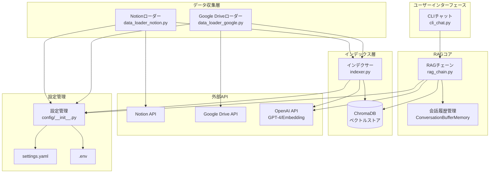
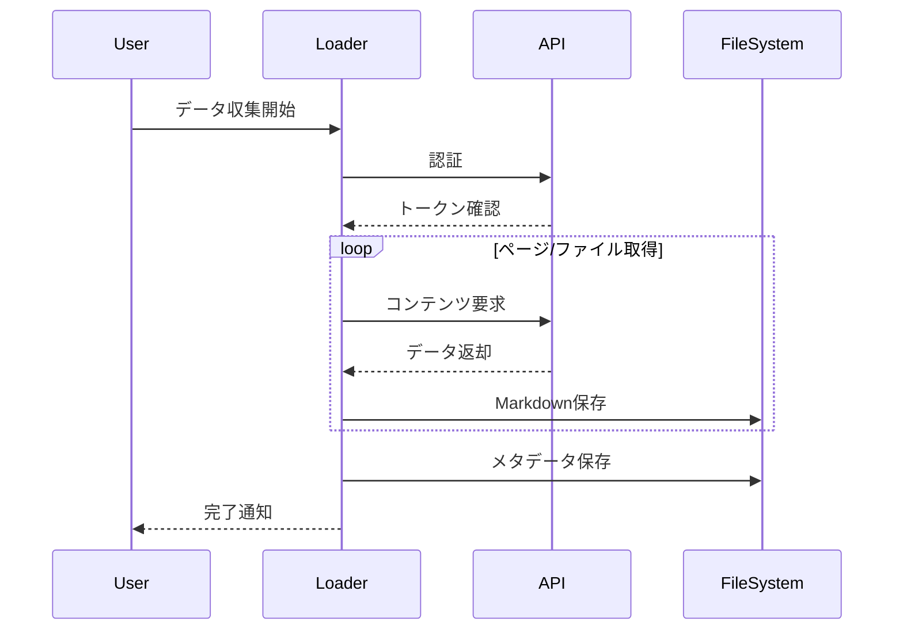
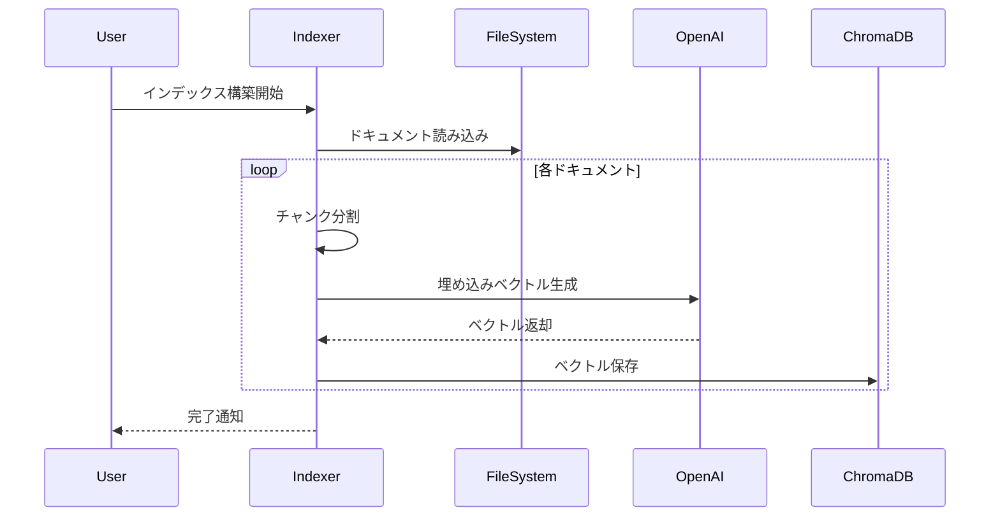
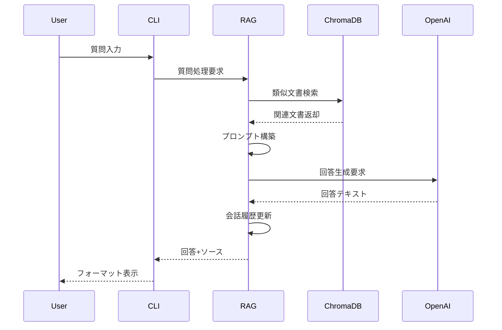

# システムアーキテクチャ

## 🏗️ 全体構成図



## 📊 データフロー

### 1. データ収集フェーズ



### 2. インデックス構築フェーズ



### 3. 質問応答フェーズ



## 🗂️ ディレクトリ構造詳細

```
phase01-local/
│
├── 📁 config/                    # 設定管理
│   ├── __init__.py              # Configクラス（設定統合）
│   └── settings.yaml            # システムパラメータ
│
├── 📁 credentials/              # 認証情報（gitignore）
│   └── google_service_account.json
│
├── 📁 data/
│   ├── 📁 chromadb/            # ベクトルDB永続化
│   │   └── [Collection Files]
│   ├── 📁 documents/           # 収集した文書
│   │   ├── 📁 notion/         # Notionマークダウン
│   │   │   ├── *.md
│   │   │   └── metadata.json
│   │   └── 📁 google/         # Google Driveテキスト
│   │       ├── *.txt
│   │       └── metadata.json
│   └── 📁 chat_logs/          # 会話履歴
│       └── chat_history_*.json
│
├── 📁 src/                     # ソースコード
│   ├── cli_chat.py            # UIレイヤー
│   ├── rag_chain.py           # ビジネスロジック
│   ├── indexer.py             # インデックス構築
│   ├── data_loader_notion.py  # Notionデータ取得
│   ├── data_loader_google.py  # Google Driveデータ取得
│   └── debug_helper.py        # デバッグユーティリティ
│
└── 📄 main.py                  # エントリーポイント
```

## 🔧 コンポーネント詳細

### 1. CLI層（cli_chat.py）
- **責務**: ユーザーインタラクション
- **機能**:
  - コマンド解析
  - 表示フォーマット
  - セッション管理
  - エラーハンドリング

### 2. RAG層（rag_chain.py）
- **責務**: 質問応答のコア処理
- **機能**:
  - ベクトル検索
  - プロンプト構築
  - LLM呼び出し
  - 会話履歴管理

### 3. データローダー層
- **責務**: 外部データの取得と変換
- **機能**:
  - API認証
  - ページネーション処理
  - テキスト抽出
  - メタデータ管理

### 4. インデクサー層（indexer.py）
- **責務**: 検索用インデックス構築
- **機能**:
  - テキスト分割
  - ベクトル化
  - ChromaDB永続化
  - バッチ処理

## 🔑 キー技術

### ベクトル埋め込み
```python
# モデル: text-embedding-3-small
# 次元数: 1536
# チャンクサイズ: 500文字
# オーバーラップ: 100文字
```

### 検索パラメータ
```python
# 検索数(k): 10
# スコア閾値: 0.2
# 距離メトリック: コサイン類似度
```

### LLMパラメータ
```python
# モデル: gpt-4o-mini
# Temperature: 0.7
# Max Tokens: 1000
```

## 🔄 処理フローの最適化

### バッチ処理
- ChromaDB追加: 100件ずつ
- 埋め込み生成: 並列処理なし（レート制限対策）

### キャッシュ戦略
- ドキュメント: ファイルシステムキャッシュ
- ベクトルDB: 永続化により再計算不要
- 会話履歴: メモリ内保持

### エラーハンドリング
```python
try:
    # API呼び出し
except RateLimitError:
    # リトライロジック
except AuthenticationError:
    # 認証エラー処理
except Exception as e:
    # 汎用エラー処理
```

## 📈 スケーラビリティ考慮

### 現在の制限
- シングルユーザー
- ローカル実行のみ
- 同期処理

### Phase 2での拡張予定
- マルチユーザー対応
- 非同期処理
- キューイングシステム
- 分散ベクトルDB

### Phase 3での拡張予定
- マイクロサービス化
- Kubernetes対応
- 自動スケーリング
- CDN統合

## 🔒 セキュリティ設計

### 認証情報管理
- 環境変数分離
- .gitignore設定
- ローカル保存のみ

### データ保護
- ローカル処理
- 外部送信最小化
- HTTPSのみ使用

### アクセス制御
- 現状: なし（ローカル実行）
- Phase 2: ユーザー認証
- Phase 3: RBAC実装予定

---

最終更新: 2025年1月20日