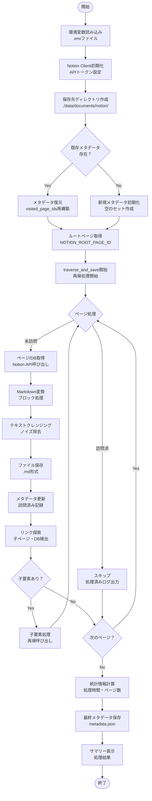
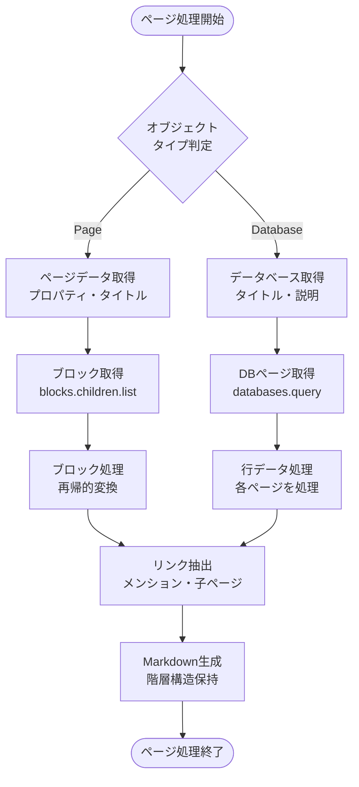
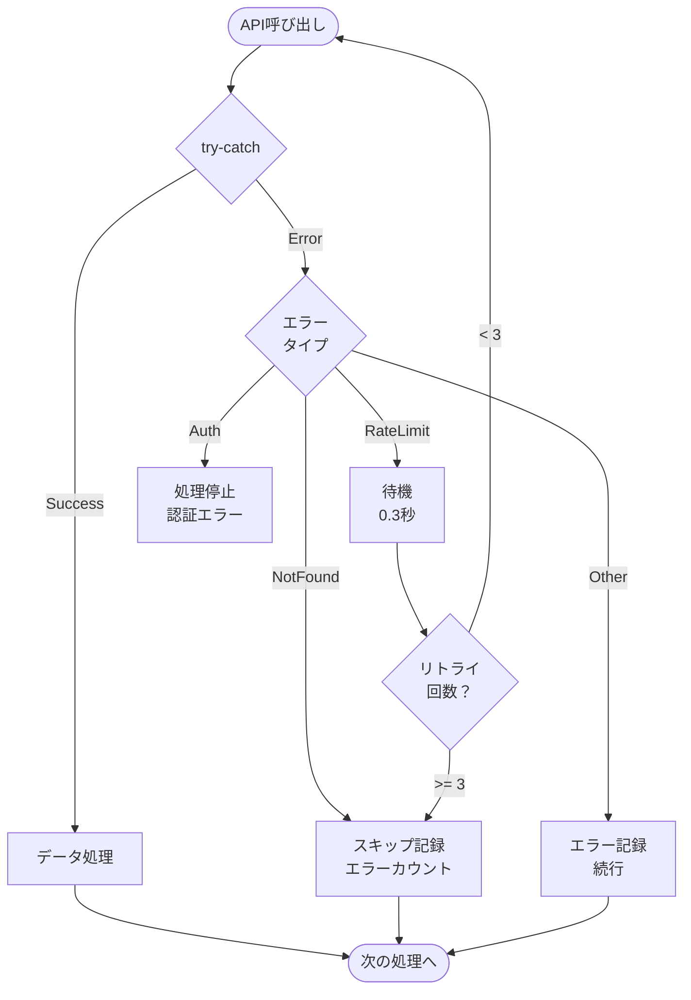

# Notionクローラー 処理フロー図

## 1. メインフローチャート



## 2. ページ処理の詳細フロー



## 3. ブロック変換の詳細

```mermaid
flowchart TD
    BlockStart([ブロック処理]) --> BlockType{ブロック<br/>タイプ}
    
    BlockType -->|paragraph| TextBlock[テキスト抽出<br/>リッチテキスト処理]
    BlockType -->|heading| HeadingBlock[見出し変換<br/># ## ###]
    BlockType -->|bulleted_list| BulletList[箇条書き<br/>- リスト]
    BlockType -->|numbered_list| NumberList[番号付きリスト<br/>1. 2. 3.]
    BlockType -->|toggle| ToggleBlock[トグル<br/>details/summary]
    BlockType -->|code| CodeBlock[コードブロック<br/>```言語```]
    BlockType -->|quote| QuoteBlock[引用<br/>> テキスト]
    BlockType -->|callout| CalloutBlock[コールアウト<br/>💡 Note:]
    BlockType -->|divider| Divider[区切り線<br/>---]
    BlockType -->|image| ImageBlock[画像<br/>]
    BlockType -->|video| VideoBlock[動画<br/>📹 Video]
    BlockType -->|file| FileBlock[ファイル<br/>📎 File]
    BlockType -->|pdf| PDFBlock[PDF<br/>📄 PDF]
    BlockType -->|bookmark| BookmarkBlock[ブックマーク<br/>🔖 リンク]
    BlockType -->|child_page| ChildPage[子ページ<br/>📄 Page Link]
    BlockType -->|child_database| ChildDB[子DB<br/>🗄️ Database]
    BlockType -->|table| TableBlock[テーブル<br/>[Table]]
    BlockType -->|embed| EmbedBlock[埋め込み<br/>🌐 Embed]
    
    TextBlock --> CheckMention{メンション<br/>含む？}
    CheckMention -->|Yes| ExtractPageID[ページID抽出<br/>後で処理]
    CheckMention -->|No| ReturnMD
    
    HeadingBlock --> ReturnMD[Markdown返却]
    BulletList --> ReturnMD
    NumberList --> ReturnMD
    ToggleBlock --> CheckChildren{子ブロック<br/>あり？}
    CodeBlock --> ReturnMD
    QuoteBlock --> ReturnMD
    CalloutBlock --> ReturnMD
    Divider --> ReturnMD
    ImageBlock --> ReturnMD
    VideoBlock --> ReturnMD
    FileBlock --> ReturnMD
    PDFBlock --> ReturnMD
    BookmarkBlock --> ReturnMD
    ChildPage --> ExtractPageID
    ChildDB --> ExtractPageID
    TableBlock --> ReturnMD
    EmbedBlock --> ReturnMD
    
    CheckChildren -->|Yes| RecurseBlocks[再帰処理<br/>子ブロック変換]
    CheckChildren -->|No| ReturnMD
    
    RecurseBlocks --> ReturnMD
    ExtractPageID --> ReturnMD
    
    ReturnMD --> BlockEnd([ブロック処理終了])
```

## 4. テキストクレンジング処理


## 5. エラー処理とレート制限



## 6. データ保存形式

```
data/documents/notion/
├── ページタイトル1.md
├── ページタイトル2.md
├── データベース名_DB.md
└── metadata.json
```

### metadata.json構造
```json
{
  "total_pages": 182,
  "total_errors": 0,
  "crawl_start": "2025-01-20T00:00:00",
  "crawl_end": "2025-01-20T00:30:00",
  "visited_page_ids": ["page_id1", "page_id2", ...],
  "root_page_id": "xxxxxxxxxxxx"
}
```

## 7. 主な特徴

### 再帰的探索
- ルートページから開始
- リンク、メンション、子ページを自動検出
- 訪問済みページはスキップ（重複防止）

### クレンジング機能
- HTMLタグ除去
- Notion固有記法の除去
- メディアファイルの簡略化
- 検索精度向上のための最適化

### エラー処理
- API レート制限対策（0.3秒待機）
- 404エラーのスキップ
- 処理継続性の確保

### 中断・再開対応
- メタデータによる進捗管理
- 訪問済みページの記録
- 差分更新が可能

---

最終更新: 2025年1月20日