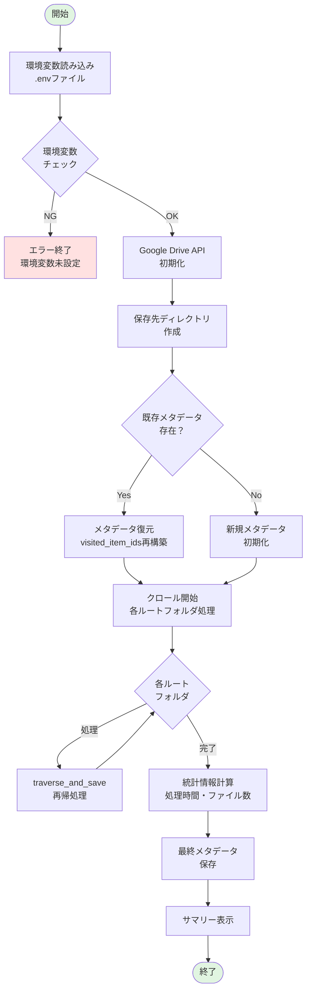
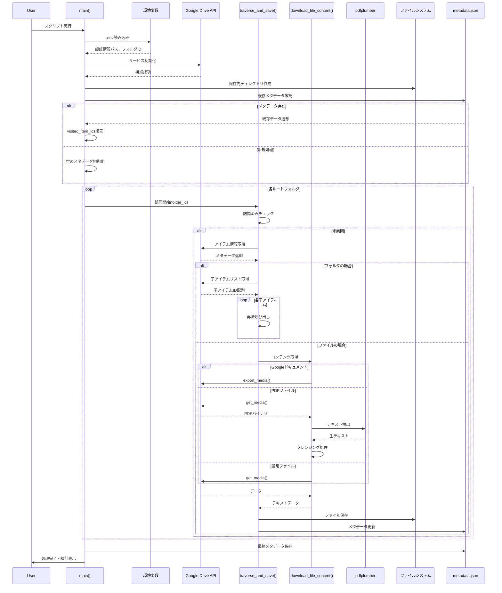
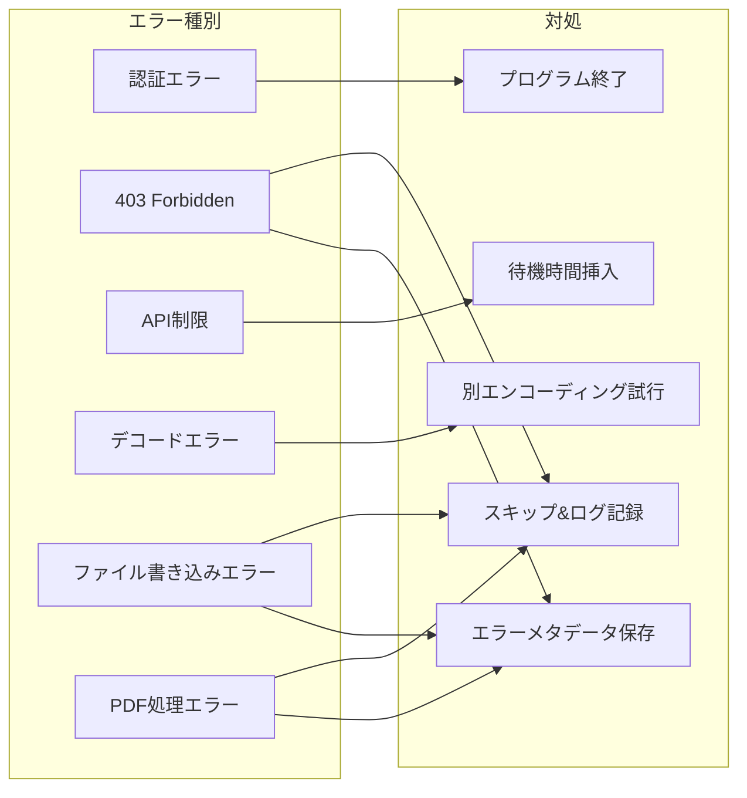
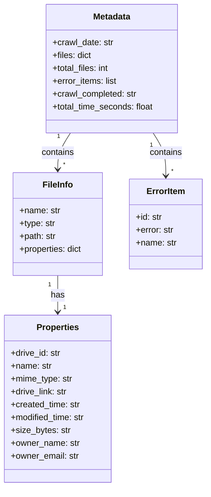

# Google Driveクローラー 処理フロー図

## 1. メインフローチャート



## 2. traverse_and_save関数の詳細フロー

```mermaid
flowchart TD
    TraverseStart([traverse_and_save開始<br/>item_id, parent_path, depth]) --> CheckVisited{訪問済み？<br/>visited_item_ids}
    
    CheckVisited -->|Yes| SkipItem[スキップ<br/>ログ出力]
    SkipItem --> TraverseEnd([終了])
    
    CheckVisited -->|No| RateLimit[レート制限<br/>0.1秒待機]
    RateLimit --> GetMeta[メタデータ取得<br/>files().get() API]
    
    GetMeta -->|成功| CheckType{アイテム<br/>タイプ判定}
    GetMeta -->|失敗| LogError[エラーログ<br/>metadata更新]
    
    CheckType -->|フォルダ| ProcessFolder[フォルダ処理]
    CheckType -->|ファイル| ProcessFile[ファイル処理]
    CheckType -->|未対応| SkipUnsupported[未対応形式<br/>スキップ]
    
    ProcessFolder --> AddVisited1[visited_item_ids<br/>に追加]
    AddVisited1 --> GetChildren[子アイテム<br/>リスト取得]
    GetChildren --> RecurseChildren{各子アイテム}
    RecurseChildren -->|再帰| TraverseStart
    RecurseChildren -->|完了| TraverseEnd
    
    ProcessFile --> CheckMime{MIME_TYPE<br/>対応？}
    CheckMime -->|No| SkipUnsupported
    CheckMime -->|Yes| AddVisited2[visited_item_ids<br/>に追加]
    
    AddVisited2 --> DownloadContent[コンテンツ<br/>ダウンロード]
    DownloadContent -->|成功| SaveFile[ファイル保存<br/>ローカル]
    DownloadContent -->|失敗| LogError
    
    SaveFile --> UpdateMeta[メタデータ更新<br/>files辞書に追加]
    UpdateMeta --> SaveMeta[metadata.json<br/>保存]
    SaveMeta --> TraverseEnd
    
    LogError --> SaveErrorMeta[エラー情報<br/>保存]
    SaveErrorMeta --> TraverseEnd
    
    SkipUnsupported --> TraverseEnd

    style TraverseStart fill:#e1f5e1
    style TraverseEnd fill:#e1f5e1
    style LogError fill:#ffe1e1
```

## 3. ファイルダウンロード処理の詳細

```mermaid
flowchart TD
    DownStart([download_file_content開始<br/>file_id, mime_type]) --> GetMimeInfo[MIME_TYPE_MAPPING<br/>から設定取得]
    
    GetMimeInfo --> CheckExport{エクスポート<br/>必要？}
    
    CheckExport -->|Yes<br/>Googleドキュメント等| ExportAPI[export_media()<br/>API使用]
    CheckExport -->|No<br/>通常ファイル| GetMediaAPI[get_media()<br/>API使用]
    
    ExportAPI --> CreateIO
    GetMediaAPI --> CreateIO[BytesIOバッファ<br/>作成]
    
    CreateIO --> DownloadChunk[チャンク単位で<br/>ダウンロード]
    
    DownloadChunk --> CheckDone{完了？}
    CheckDone -->|No| NextChunk[次のチャンク<br/>取得]
    NextChunk --> DownloadChunk
    
    CheckDone -->|Yes| CheckPDF{PDFファイル？}
    
    CheckPDF -->|Yes| PDFExtract[pdfplumber<br/>テキスト抽出]
    PDFExtract --> PDFClean[PDFテキスト<br/>クレンジング]
    PDFClean --> ReturnContent[テキスト<br/>返却]
    
    CheckPDF -->|No| DecodeUTF8[UTF-8<br/>デコード試行]
    
    DecodeUTF8 -->|成功| ReturnContent
    DecodeUTF8 -->|失敗| DecodeLatin1[Latin-1<br/>強制デコード]
    
    DecodeLatin1 --> ReturnContent
    ReturnContent --> DownEnd([終了])
    
    ExportAPI -->|403エラー| AccessDenied[アクセス権限なし<br/>ログ出力]
    GetMediaAPI -->|403エラー| AccessDenied
    PDFExtract -->|エラー| PDFError[PDF処理エラー<br/>ログ出力]
    
    AccessDenied --> ReturnNull[None返却]
    PDFError --> ReturnNull
    ReturnNull --> DownEnd

    style DownStart fill:#e1f5e1
    style DownEnd fill:#e1f5e1
    style AccessDenied fill:#ffe1e1
    style PDFError fill:#ffe1e1
```

## 4. PDFテキストクレンジング処理


## 5. シーケンス図



## 6. エラー処理フロー



## 7. データ構造



## 8. 処理の特徴

### 再開可能性
- `metadata.json`に進捗を逐次保存
- `visited_item_ids`で処理済みアイテムを管理
- 中断後も同じポイントから再開可能

### レート制限対策
- 各API呼び出し前に0.1秒の待機時間
- 過度なリクエストによるAPI制限を回避

### エラー耐性
- 個別ファイルのエラーが全体処理を止めない
- エラー情報を記録し、後で確認可能
- アクセス権限がないファイルは自動スキップ

### 柔軟なファイル形式対応
- Googleドキュメント → テキストエクスポート
- スプレッドシート → CSV形式
- プレゼンテーション → テキスト形式
- PDFファイル → pdfplumberでテキスト抽出 + クレンジング
- 通常ファイル → 直接ダウンロード

### PDF処理の最適化
- pdfplumberによる高精度レイアウト解析
- RAG検索精度向上のためのテキストクレンジング
- ページマーカー、制御文字、文字化けの除去
- Unicode正規化（NFKC形式）で文字の統一

---

最終更新: 2025年1月20日