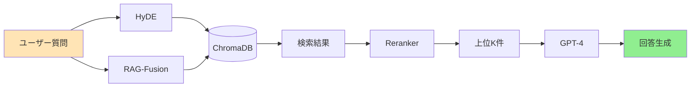

# Phase 2: Advanced RAG 実装ガイド

## 📚 概要

Phase 2では、3つの先進的なRAG技術を実装して検索精度を90%以上に向上させます。

---

## 🎯 実装する3つの技術

### 1. HyDE (Hypothetical Document Embeddings)

#### 概念
ユーザーの短い質問から「理想的な回答」を先に生成し、その回答と類似した文書を検索する手法。

#### なぜ効果的か
- 短い質問 → 豊富なコンテキストへ変換
- 検索時のセマンティックギャップを解消
- Zero-shotで精度向上

#### 実装のポイント
```python
# 基本的な流れ
質問 → LLMで仮想回答生成 → 仮想回答で検索 → 実文書を取得
```

### 2. RAG-Fusion

#### 概念
1つの質問から複数の関連クエリを生成し、並列検索の結果をReciprocal Rank Fusion (RRF)で統合。

#### なぜ効果的か
- 多角的な視点から情報収集
- 検索漏れを大幅に削減
- より網羅的な回答が可能

#### RRFアルゴリズム
```
score(d) = Σ 1/(k + rank(d))
k = 60 (一般的なデフォルト値)
```

### 3. Reranker

#### 概念
初期検索結果を、より精密なモデルで再評価して順位を入れ替える。

#### 実装オプション
1. **Cohere Rerank API** - 高精度、多言語対応
2. **Cross-Encoder** - ローカル実行可能、カスタマイズ性高

#### 使い分け
- 精度重視 → Cohere
- コスト重視 → Cross-Encoder
- 両方使用 → ハイブリッド

---

## 🔄 全体のアーキテクチャ



---

## 📁 プロジェクト構造

```
phase02-advanced-rag/
├── src/
│   ├── hyde.py              # HyDE実装
│   ├── rag_fusion.py        # RAG-Fusion実装
│   ├── reranker.py          # Reranker実装
│   └── advanced_rag_chain.py # 統合チェーン
├── config/
│   └── settings.yaml        # 設定ファイル
├── tests/
│   └── benchmark.py         # 性能評価
└── docs/
    ├── 01.実装ガイド.md     # 本ファイル
    └── 02.アーキテクチャ.md # システム設計
```

---

## 🚀 実装手順

### Step 1: 環境構築

1. **仮想環境の作成**
   ```bash
   python -m venv .venv
   source .venv/bin/activate
   ```

2. **必要パッケージのインストール**
   ```bash
   pip install -r requirements.txt
   ```

3. **環境変数の設定**
   ```bash
   cp .env.example .env
   # OPENAI_API_KEY, COHERE_API_KEY を設定
   ```

### Step 2: Phase 1のChromaDBを参照

```yaml
# config/settings.yaml
chromadb:
  persist_directory: "../phase01-local/data/chromadb"
  collection_name: "phase01_documents"
```

### Step 3: 各モジュールの実装

#### HyDE実装の要点
- 仮想回答は2-3個生成（多様性確保）
- 温度パラメータを変えて生成
- 重複除去を忘れずに

#### RAG-Fusion実装の要点
- クエリは5個程度生成
- 元のクエリも必ず含める
- RRFのk値は60がデフォルト

#### Reranker実装の要点
- APIエラー時のフォールバック実装
- バッチサイズに注意（メモリ制限）
- スコアの正規化

### Step 4: 統合とテスト

1. **統合チェーンの構築**
   - 各技術のON/OFF切り替え可能に
   - パイプライン形式で実装

2. **ベンチマークテスト**
   ```bash
   python tests/benchmark.py
   ```

3. **性能比較**
   - ベースライン vs 各技術 vs 全技術統合
   - 検索時間と精度のトレードオフ評価

---

## 📊 評価指標

### 主要メトリクス
- **検索精度**: Precision@K, Recall@K
- **応答時間**: エンドツーエンドのレイテンシ
- **コスト**: API呼び出し回数と料金

### 目標値
| 指標 | Phase 1 | Phase 2目標 |
|------|---------|------------|
| 検索精度 | 69-88% | 90-95% |
| 応答時間 | 8-12秒 | 5-8秒 |
| 関連性スコア | 0.7 | 0.85+ |

---

## 🔧 チューニングポイント

### HyDE
- `num_hypothetical`: 仮想回答の生成数（2-3が最適）
- `temperature`: 生成の多様性（0.5-0.9）

### RAG-Fusion
- `num_queries`: 生成クエリ数（4-6が最適）
- `rrf_k`: RRFパラメータ（60がデフォルト）

### Reranker
- `top_k`: 再順位付け後の文書数
- `model`: Cohereモデルの選択

---

## ⚠️ 注意事項

1. **APIレート制限**
   - Cohere: 1分100リクエストまで
   - OpenAI: ティアによって異なる

2. **メモリ使用量**
   - Cross-Encoderモデルは約1GB
   - バッチサイズの調整が必要

3. **コスト管理**
   - Cohere Rerankは1000リクエスト/$1
   - 開発時はCross-Encoderを推奨

---

## 📚 参考資料

- [HyDE論文](https://arxiv.org/abs/2212.10496)
- [RAG-Fusion概要](https://github.com/Raudaschl/RAG-Fusion) 
- [Cohere Rerank](https://docs.cohere.com/docs/reranking)
- 書籍「LangChainとLangGraphによる RAG・AIエージェント［実践］入門」第6章

---

*最終更新: 2025年1月21日*