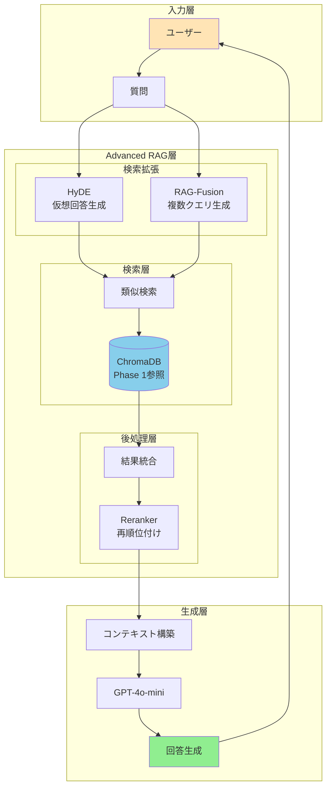
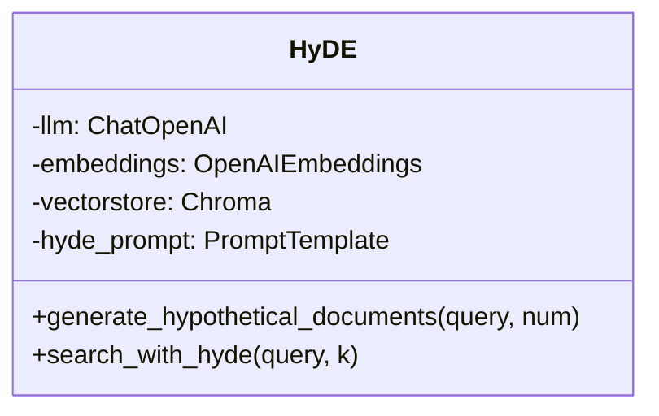
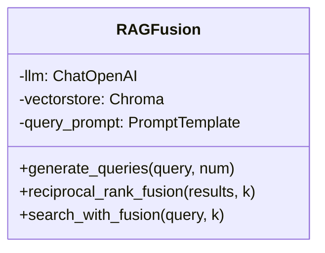
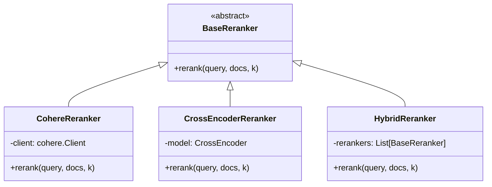
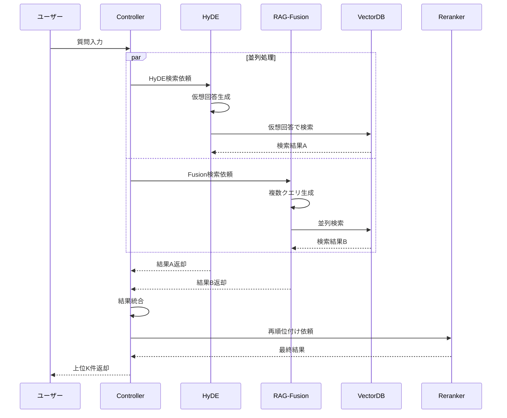
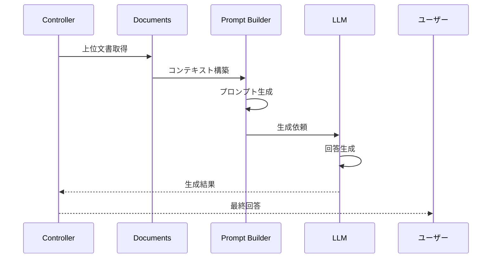
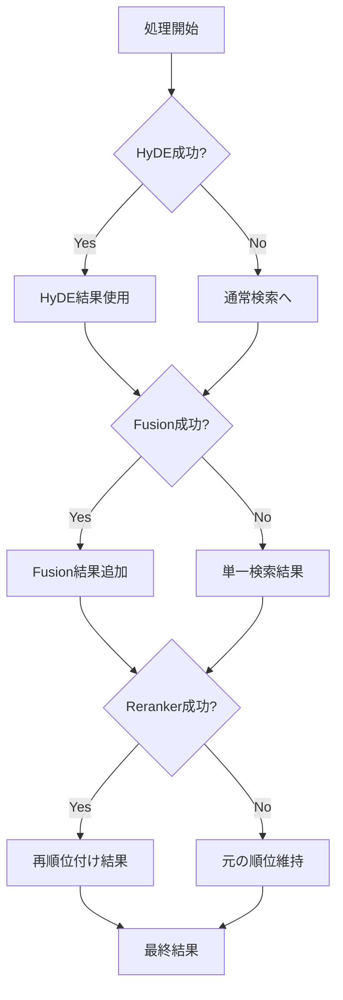

# Phase 2: Advanced RAG アーキテクチャ設計

## 🏗️ システム全体図



---

## 📐 コンポーネント設計

### 1. HyDEコンポーネント



**責務**:
- 質問から仮想回答を生成
- 仮想回答による検索実行
- 結果の重複除去

### 2. RAG-Fusionコンポーネント



**責務**:
- 複数の検索クエリ生成
- 並列検索の実行
- RRFによる結果統合

### 3. Rerankerコンポーネント



**責務**:
- 検索結果の再評価
- スコアベースの再順位付け
- 複数手法のハイブリッド実行

---

## 🔄 データフロー

### 1. 検索フロー



### 2. 回答生成フロー



---

## 💾 データモデル

### SearchResult
```python
@dataclass
class SearchResult:
    document: Document
    score: float
    method: str  # "hyde", "fusion", "base"
    metadata: Dict[str, Any]
```

### AdvancedRAGResponse
```python
@dataclass
class AdvancedRAGResponse:
    query: str
    answer: str
    source_documents: List[Document]
    scores: List[float]
    retrieval_time: float
    generation_time: float
    total_time: float
    config_used: Dict[str, bool]
```

---

## ⚙️ 設定管理

### 設定ファイル構造

```yaml
# config/settings.yaml

# ChromaDB設定（Phase 1を参照）
chromadb:
  persist_directory: "../phase01-local/data/chromadb"
  collection_name: "phase01_documents"

# HyDE設定
hyde:
  enabled: true
  num_hypothetical: 3
  temperature: 0.7
  max_length: 500

# RAG-Fusion設定
fusion:
  enabled: true
  num_queries: 5
  rrf_k: 60

# Reranker設定
reranker:
  enabled: true
  type: "hybrid"  # "cohere", "cross_encoder", "hybrid"
  top_k: 10
  
# LLM設定
llm:
  model: "gpt-4o-mini"
  temperature: 0.7
  max_tokens: 1000

# パフォーマンス設定
performance:
  cache_enabled: true
  cache_ttl: 3600
  batch_size: 10
  max_workers: 4
```

---

## 🔐 エラーハンドリング

### フォールバック戦略



### エラー種別と対処

| エラー種別 | 原因 | 対処法 |
|-----------|------|--------|
| API Timeout | ネットワーク遅延 | リトライ（指数バックオフ） |
| Rate Limit | API制限超過 | 待機後リトライ or フォールバック |
| Memory Error | モデルサイズ大 | バッチサイズ削減 |
| Invalid Response | LLM出力エラー | プロンプト調整 or 再実行 |

---

## 📊 モニタリング

### 監視メトリクス

1. **パフォーマンス**
   - 各コンポーネントの処理時間
   - エンドツーエンドのレイテンシ
   - スループット（req/sec）

2. **品質**
   - 検索精度（Precision/Recall）
   - 回答の関連性スコア
   - ユーザーフィードバック

3. **リソース**
   - メモリ使用量
   - API呼び出し回数
   - キャッシュヒット率

### ログ設計

```python
# ログレベル
DEBUG: 詳細な処理フロー
INFO: 主要な処理ステップ
WARNING: フォールバック発生
ERROR: エラー発生
```

---

## 🚀 スケーラビリティ

### 水平スケーリング
- 検索処理の並列化
- 複数インスタンスでの負荷分散

### 垂直スケーリング
- GPUによるモデル推論高速化
- メモリ増設による大規模バッチ処理

### キャッシング戦略
- クエリ結果のキャッシュ（TTL: 1時間）
- 埋め込みベクトルのキャッシュ
- LLM応答のキャッシュ（同一質問）

---

*最終更新: 2025年1月21日*