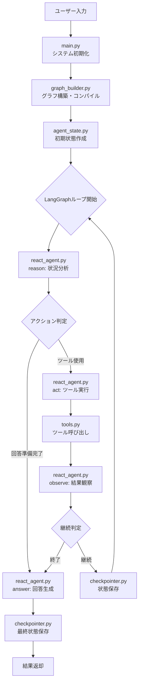
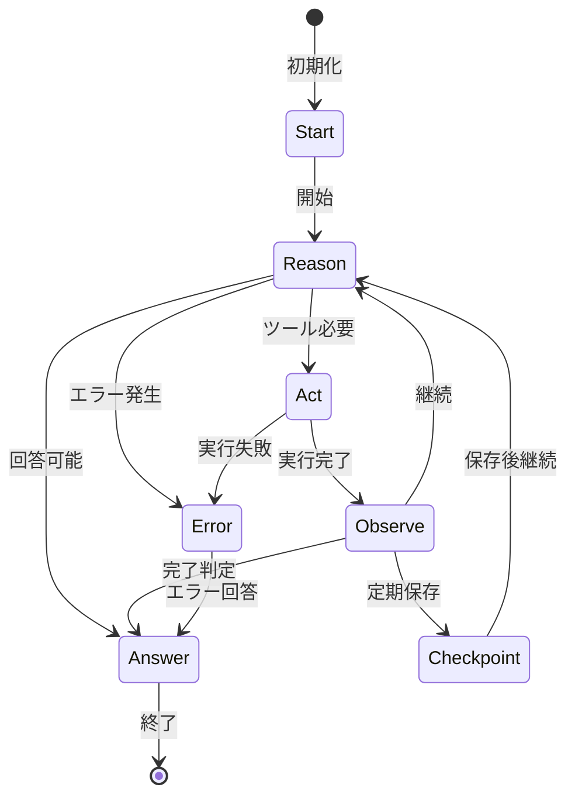
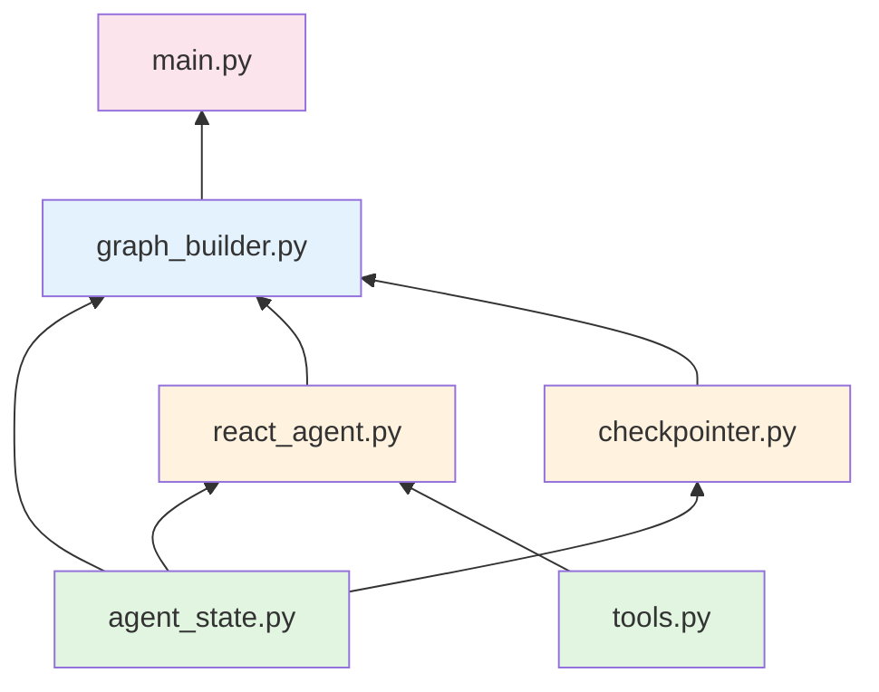

# Phase 3 LangGraphエージェント - アーキテクチャドキュメント

## 📚 概要

本ドキュメントは、Phase 3 LangGraphエージェントのアーキテクチャと実装詳細を説明します。
コードレビューの際の参考ガイドとしてもご活用ください。

---

## 📖 ソースコード構成とレビュー順序

### レビュー推奨順序

以下の順序でソースコードをレビューすることで、システム全体の理解が深まります：

#### 1️⃣ **agent_state.py** - 基盤データ構造
**役割**: エージェントの状態管理とデータ構造定義

**主要コンポーネント**:
- `AgentState`: エージェントの完全な状態を表現するTypedDict
- `ReasoningStep`: 推論ステップの記録
- `ToolCall`: ツール呼び出しの記録
- `CheckpointData`: チェックポイントデータ

**重要な関数**:
- `create_initial_state()`: 初期状態の生成
- `add_reasoning_step()`: 推論履歴の追加
- `should_continue()`: 処理継続判定
- `extract_final_state()`: 最終結果の抽出

#### 2️⃣ **tools.py** - ツール実装層
**役割**: エージェントが使用可能な外部ツールの実装

**主要コンポーネント**:
- `ToolsManager`: ツールの統合管理
- `RAGSearchTool`: Phase 1のChromaDBを使用した文書検索
- `CalculatorTool`: 数式計算
- `FileHandlerTools`: ファイル読み書き
- `WebSearchTool`: Tavily APIによるWeb検索（オプション）

**入力スキーマ**:
- `RAGSearchInput`, `CalculatorInput`, `FileReadInput`, `FileWriteInput`

#### 3️⃣ **react_agent.py** - コアエージェント実装
**役割**: ReActパターンによる推論と行動の実装

**主要コンポーネント**:
- `ReActAgent`: メインエージェントクラス
- `ReActThought`: 推論プロセスのデータモデル

**処理ステップ**:
1. `reason()`: 現状分析と次のアクション決定
2. `act()`: ツール実行
3. `observe()`: 結果観察と次ステップ判断
4. `answer()`: 最終回答生成

**プロンプト設計**:
- システムプロンプト: ReActパターンの指示
- 推論プロンプト: 段階的思考の誘導

#### 4️⃣ **checkpointer.py** - 永続化層
**役割**: エージェント状態の保存と復元

**主要機能**:
- チェックポイントの自動保存
- 圧縮保存（gzip）
- 古いチェックポイントの自動削除
- メタデータ管理

**主要メソッド**:
- `save_checkpoint()`: 状態保存
- `load_checkpoint()`: 状態復元
- `list_checkpoints()`: 一覧取得
- `_cleanup_old_checkpoints()`: 自動クリーンアップ

#### 5️⃣ **graph_builder.py** - オーケストレーション層
**役割**: LangGraphによる処理フローの制御

**グラフ構造**:
- **ノード**: start, reason, act, observe, answer, checkpoint
- **エッジ**: 条件付き遷移と固定遷移
- **ルーティング**: 動的な経路決定

**主要メソッド**:
- `_build_graph()`: グラフ構築
- `_route_after_reason()`: 推論後のルーティング
- `_route_after_observe()`: 観察後のルーティング
- `compile()`: グラフのコンパイル
- `run()`: 実行エントリーポイント

#### 6️⃣ **main.py** - エントリーポイント
**役割**: CLIインターフェースと全体統合

**機能**:
- 対話モード実装
- コマンド処理（/help, /tools, /list等）
- 環境変数チェック
- コンポーネント初期化

---

## 🔄 処理フローとアーキテクチャ

### システム全体のフロー



### 状態遷移図



### コンポーネント間の依存関係



---

## 🎯 重要な処理の詳細

### 1. 初期化フロー

```python
# main.py
LangGraphAgent.__init__()
  ├── _check_environment()         # 環境変数確認
  ├── ChatOpenAI.__init__()       # LLM初期化
  ├── ToolsManager.__init__()     # ツール初期化
  │   ├── _setup_rag_search()     # RAG検索設定
  │   ├── _setup_calculator()     # 計算ツール設定
  │   └── _setup_file_handler()   # ファイル操作設定
  ├── CheckpointManager.__init__() # チェックポイント初期化
  └── GraphBuilder.__init__()      # グラフ構築
      ├── ReActAgent.__init__()   # エージェント初期化
      └── _build_graph()           # グラフ定義
```

### 2. クエリ実行フロー

```python
# GraphBuilder.run(query)
1. create_initial_state(query)     # 初期状態作成
2. graph.compile()                  # グラフコンパイル
3. app.stream(initial_state)        # ストリーミング実行
   └── for each node:
       ├── _start_node()           # 開始処理
       ├── _reason_node()          # 推論
       │   └── ReActAgent.reason()
       ├── _act_node()             # アクション
       │   └── ReActAgent.act()
       │       └── tool.invoke()
       ├── _observe_node()         # 観察
       │   └── ReActAgent.observe()
       ├── _answer_node()          # 回答
       │   └── ReActAgent.answer()
       └── _checkpoint_node()      # 保存
           └── CheckpointManager.save_checkpoint()
4. extract_final_state(state)      # 結果抽出
```

### 3. ReActループの詳細

```python
# ReActAgent内部フロー
while should_continue(state):
    # 1. Reasoning（推論）
    thought = llm.invoke(react_prompt)
    state = add_reasoning_step(state, thought)
    
    # 2. Acting（行動）
    if thought.action_needed:
        result = tool.invoke(thought.action_input)
        state = add_tool_call(state, tool_name, result)
    
    # 3. Observation（観察）
    state["iteration_count"] += 1
    if state["iteration_count"] >= max_iterations:
        break
        
# 4. Answer（回答）
final_answer = llm.invoke(final_answer_prompt)
state["final_answer"] = final_answer
```

---

## 💡 設計上の重要ポイント

### 1. State管理パターン
- **Immutable State**: 各ステップで新しい状態を生成
- **TypedDict使用**: 型安全性の確保
- **Annotated使用**: メッセージの累積管理

### 2. エラーハンドリング
- **各層でのtry-catch**: 堅牢性の確保
- **エラー状態の伝播**: stateにerrorフィールド
- **グレースフルな終了**: エラー時も回答生成

### 3. 拡張性の考慮
- **ツールの追加**: ToolsManagerに新規ツール登録
- **ノードの追加**: GraphBuilderでグラフ拡張
- **プロンプトのカスタマイズ**: 設定ファイルで調整

### 4. パフォーマンス最適化
- **ストリーミング応答**: リアルタイムフィードバック
- **チェックポイント圧縮**: ストレージ効率化
- **条件付き保存**: 必要時のみチェックポイント作成

---

## 🔧 カスタマイズポイント

### 新しいツールの追加

```python
# tools.pyに新規ツールを追加
class CustomToolInput(BaseModel):
    param: str = Field(description="パラメータ")

def _setup_custom_tool(self):
    tool = StructuredTool.from_function(
        func=self._custom_function,
        name="custom_tool",
        description="カスタムツールの説明",
        args_schema=CustomToolInput
    )
    self.tools.append(tool)
```

### グラフの拡張

```python
# graph_builder.pyでノード追加
workflow.add_node("custom", self._custom_node)
workflow.add_edge("reason", "custom")
workflow.add_conditional_edges(
    "custom",
    self._route_after_custom,
    {"next": "observe", "end": END}
)
```

### プロンプトのカスタマイズ

```yaml
# config/settings.yamlで調整
react:
  max_reasoning_steps: 10
  enable_reflection: true
  custom_system_prompt: "カスタムプロンプト"
```

---

## 📊 メトリクスとモニタリング

### パフォーマンス指標
- **応答時間**: 3-5秒目標
- **イテレーション数**: 平均3-5回
- **ツール呼び出し回数**: クエリあたり1-3回
- **チェックポイントサイズ**: 10-50KB/保存

### ログポイント
- 各ノードの開始/終了
- ツール呼び出しと結果
- エラー発生箇所
- チェックポイント保存

---

## 🚀 今後の拡張可能性

1. **マルチエージェント対応**: Phase 4への準備
2. **並列ツール実行**: 複数ツールの同時実行
3. **動的グラフ生成**: クエリに応じたグラフ構築
4. **外部サービス統合**: API連携の追加

